# INT-SYS1-NIX - suivi 2025 - 1INT-S-PMa

**Bienvenue au cours "Systèmes d'exploitation de type Unix"**<br/>*Dans le respect mutuel, l’écoute et l’implication réciproque*


*Geekscottes, si tu crois que dans 1km, il y a 1024m, reste un peu - [http://www.nojhan.net/geekscottes/index.php?id=58]*


[[_TOC_]]

---
# Leçon 01 - 2026-01-28 (5p)

>Présentation du module, prise en main, shell
>
>“graphical user interfaces make easy tasks easy, while command line interfaces make difficult tasks possible”

## Accueil

* [Bienvenue](https://mylos.s2.rpn.ch/cours/int-sys1-nix/bienvenue/)
* [Accueil](https://mylos.s2.rpn.ch/cours/int-sys1-nix/accueil/)

## Prise en main

* [Le shell](https://mylos.s2.rpn.ch/cours/int-sys1-nix/shell/)
   1. [Prise en main](https://mylos.s2.rpn.ch/cours/int-sys1-nix/shell/prise-en-main/)
      * [Présentation Unix, rappel et définition](https://mylos.s2.rpn.ch/cours/int-sys1-nix/shell/rappel-definition/)
      * [Bash, BNF](https://mylos.s2.rpn.ch/cours/int-sys1-nix/shell/bnf-bash/)
      * [The Linux Commande Line](http://linuxcommand.org/tlcl.php)
   1. [Accès au serveur pédagogique Linux](https://mylos.s2.rpn.ch/cours/int-sys1-nix/shell/serveur-pedagogique/)
      * [lien vers les clés](https://rpns2-my.sharepoint.com/:f:/g/personal/huguenindo_s2_rpn_ch/IgBJsjqBxNjAQqzvB9ARtZfPAd8HURsOOxQmGNADLsmNv6g?e=5W3nJB)
      * mot de passe pour l'utilisation des clés ssh : `<username>pass$`
      * diminuer les droits sur les clé privé (chmod go= <clé privé>)
   1. Activité [Activités, série 0001 - Prise en main](https://mylos.s2.rpn.ch/cours/int-sys1-nix/activites/sysnix-activite-0001-prise-en-main/)

## gameshell

[gameshell](https://github.com/phyver/GameShell/blob/master/README-fr.md)

* préparation
   ```bash
   huguenindo@lozan:~$ ln -s /usr/local/games/gameshell.sh gameshell.sh
   ```
* exécution de jeu
   ```bash
   huguenindo@lozan:~$ ./gameshell.sh
   ```

### missions  de gameshell

>Pour les personnes avancées, résoudre la mission en un minimum de commandes!

1. basic/01_cd_tower (réussie)
1. basic/02_cd.._cellar (réussie)
1. basic/03_cd_HOME_throne (réussie)
1. basic/04_mkdir_chest (réussie)
1. basic/05_rm_spiders_cellar (réussie)
1. basic/06_mv_coins_garden (réussie)
1. basic/07_mv_hidden_coins_garden (réussie)
1. basic/08_rm_wildcard_spiders_cellar (réussie)
1. basic/09_rm_wildcard_hidden_spiders_cellar (réussie)
1. basic/10_cp_standard_great_hall (réussie)
1. basic/11_cp_wildcards_tapestries_great_hall (réussie)
1. basic/12_cp_ls_mtime_paintings_tower (réussie)
1. misc/01_cal_nostradamus (réussie)
1. intermediate/01_alias_la (réussie)
1. misc/02_nano_journal (réussie)
1. intermediate/02_alias_journal (réussie)
1. intermediate/03_tab_spider_lair (réussie)
1. intermediate/04_bg_xeyes (annulée)
1. finding_files_maze/01_ls_cd (réussie)
1. finding_files_maze/02_tree (réussie)
1. finding_files_maze/03_find_1 (réussie)
1. pipe_intro_book_of_potions/01_head (réussie)
1. pipe_intro_book_of_potions/02_tail (réussie)
1. pipe_intro_book_of_potions/03_cat (réussie)
1. pipe_intro_book_of_potions/04_pipe (réussie)
1. pipe_intro_book_of_potions/05_pipe_head_tail (réussie)
1. processes/01_ps_kill (réussie)
1. processes/02_ps_kill_signal (réussie)
1. processes/03_pstree_kill (réussie)
1. stdin_stdout_stderr/01_stdin_additions (réussie)
1. stdin_stdout_stderr/02_stdin_redirection_multiplications (réussie)
1. stdin_stdout_stderr/03_stdout_redirection_inventory (réussie)
1. stdin_stdout_stderr/04_stderr_dev-null_grimoires (réussie)
1. stdin_stdout_stderr/05_stdout_stderr_redirection_merlin (réussie)
1. permissions/01_chmod_x_dir_king_quarter (réussie)
1. permissions/02_chmod_r_file_king_quarter (réussie)
1. permissions/03_chmod_rw_file_dir_throne_room (réussie)
1. finding_files_maze/04_find_2 (réussie)
1. finding_files_maze/05_find_xargs_grep (réussie)
1. pipes_merchant_stall/01_pipe_1 (réussie)
1. pipes_merchant_stall/02_pipe_2 (réussie)
1. misc/03_tr_caesar_shift (réussie)


## A faire

* A étudier les documents
   * [Présentation Unix, rappel et définition](https://mylos.s2.rpn.ch/cours/int-sys1-nix/shell/rappel-definition/)
   * [Motif Générique](https://mylos.s2.rpn.ch/cours/int-sys1-nix/shell/motif-generique/)
   * [Filtre et Redirection](https://mylos.s2.rpn.ch/cours/int-sys1-nix/shell/redirection-filtre/)
* faire gameshell jusqu'à la mission 12/43

## Note

1. supprimer la passphrase de la clé privée ssh [How to Remove the Passphrase From an Existing SSH Key](https://www.baeldung.com/linux/remove-ssh-key-password)
1. connexion à lozan
  ```bash
  huguenindo@debian-usb:~$ ssh huguenindo@lozan0.node.dhu -oProxyCommand="ssh huguenindo@kobenhavn.s2.rpn.ch -A -i ~/.ssh/huguenindo@kobenhavn_rsa -W %h:%p" -i ~/.ssh/huguenindo@lozan0_rsa -A
  Linux lozan 6.1.0-25-amd64 #1 SMP PREEMPT_DYNAMIC Debian 6.1.106-3 (2024-08-26) x86_64

  The programs included with the Debian GNU/Linux system are free software;
  the exact distribution terms for each program are described in the
  individual files in /usr/share/doc/*/copyright.

  Debian GNU/Linux comes with ABSOLUTELY NO WARRANTY, to the extent
  permitted by applicable law.
  Last login: Tue Jan 28 11:05:55 2025 from 172.16.1.10
  huguenindo@lozan0:~$ w
  08:50:29 up 91 days, 21:51,  7 users,  load average: 0.12, 0.09, 0.09
  UTIL.    TTY      DE               LOGIN@   IDLE   JCPU   PCPU QUOI
  huguenin pts/0    172.16.1.10      08:29    1.00s  0.01s  0.01s w
  dilke    pts/1    172.16.1.10      08:30   12:09   0.00s   ?    -bash
  cattarin pts/2    172.16.1.10      08:31   13.00s  0.03s   ?    sudo -s
  hazerajh pts/3    172.16.1.10      08:31   18:34   0.00s   ?    -bash
  maurerr1 pts/4    172.16.1.10      08:32   18:18   0.00s   ?    -bash
  bastosda pts/6    172.16.1.10      08:41    8:47   0.00s   ?    -bash
  borcardj pts/7    172.16.1.10      08:43   14.00s  0.02s  0.02s -bash
  huguenindo@lozan:~$ exit
  déconnexion
  Connection to lozan0.node.dhu closed.
  huguenindo@debian-usb:~$ ssh lozan
  Linux lozan 6.1.0-25-amd64 #1 SMP PREEMPT_DYNAMIC Debian 6.1.106-3 (2024-08-26) x86_64

  The programs included with the Debian GNU/Linux system are free software;
  the exact distribution terms for each program are described in the
  individual files in /usr/share/doc/*/copyright.

  Debian GNU/Linux comes with ABSOLUTELY NO WARRANTY, to the extent
  permitted by applicable law.
  Last login: Wed Jan 29 08:29:45 2025 from 172.16.1.10
  huguenindo@lozan0:~$ 
  huguenindo@lozan0:~$ 
  huguenindo@lozan0:~$ exit
  déconnexion
  Connection to lozan0.node.dhu closed.
  huguenindo@debian-usb:~$ ssh -F ~/.ssh/config lozan
  Linux lozan 6.1.0-25-amd64 #1 SMP PREEMPT_DYNAMIC Debian 6.1.106-3 (2024-08-26) x86_64

  The programs included with the Debian GNU/Linux system are free software;
  the exact distribution terms for each program are described in the
  individual files in /usr/share/doc/*/copyright.

  Debian GNU/Linux comes with ABSOLUTELY NO WARRANTY, to the extent
  permitted by applicable law.
  Last login: Wed Jan 29 08:54:33 2025 from 172.16.1.10
  huguenindo@lozan0:~$ exit
  déconnexion
  Connection to lozan0.node.dhu closed.
  ```


q


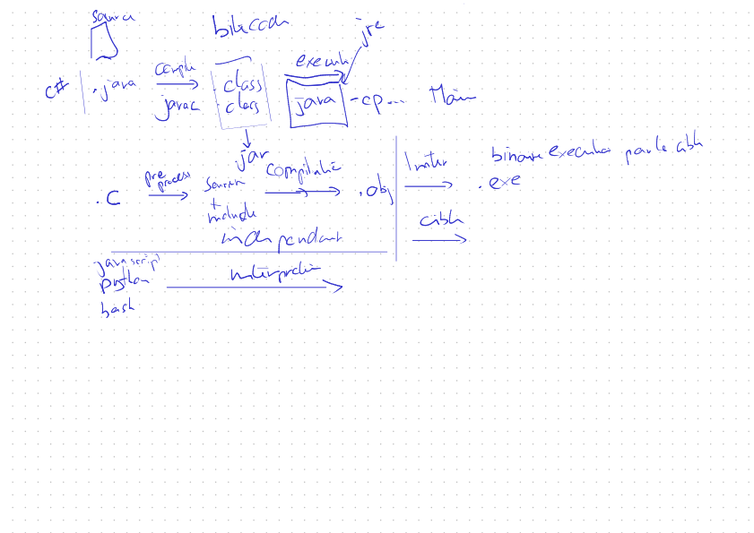


# Leçon 02 - 2026-02-04 (5p)

>shell

## Questions?

## Fichiers
* [Le shell](https://mylos.s2.rpn.ch/cours/int-sys1-nix/shell/)
   1. [Système de fichier](https://mylos.s2.rpn.ch/cours/int-sys1-nix/shell/systeme-fichier/)
      * [Motif Générique](https://mylos.s2.rpn.ch/cours/int-sys1-nix/shell/motif-generique/)
   1. Activité [Activités, série 0002 - Gestion Fichier](https://mylos.s2.rpn.ch/cours/int-sys1-nix/activites/sysnix-activite-0002-gestion-fichier/)
      * [Éléments de solution](elements-de-solution/sysnix-activite-0002-gestion-fichier)

## Fiches

1. [Fiches - Lien hardware et symbolique](https://mylos.s2.rpn.ch/cours/int-sys1-nix/fiches/shell-lien/)
1. [Fiches - Processus et sous-processus](https://mylos.s2.rpn.ch/cours/int-sys1-nix/fiches/shell-processus/)
1. [Fiches - Chaînage des commandes](https://mylos.s2.rpn.ch/cours/int-sys1-nix/fiches/shell-chainage-commande/)
1. [Fiches - Prototype C](https://mylos.s2.rpn.ch/cours/int-sys1-nix/fiches/shell-prototype-c/)

## redirection et filtre

* [Le shell](https://mylos.s2.rpn.ch/cours/int-sys1-nix/shell/)
   1. [Filtre et Redirection](https://mylos.s2.rpn.ch/cours/int-sys1-nix/shell/redirection-filtre/)
   1. [Activités, série 0003 - Redirection et filtre](https://mylos.s2.rpn.ch/cours/int-sys1-nix/activites/sysnix-activite-0003-redirection-filtre/) 
      * [Éléments de solution](elements-de-solution/sysnix-activite-0003-redirection-filtre)

## Script

* [Le shell](https://mylos.s2.rpn.ch/cours/int-sys1-nix/shell/)
   1. [Édition des fichiers avec VIM](https://mylos.s2.rpn.ch/cours/int-sys1-nix/shell/vim/)
      * faire le tutorial `vimtutor fr`

## A faire

1. faire le tutorial `vimtutor fr`
1. terminer l'[Activités, série 0003 - Redirection et filtre](https://mylos.s2.rpn.ch/cours/int-sys1-nix/activites/sysnix-activite-0003-redirection-filtre/) 
1. Continuer gameshell

## Note

```
huguenindo@lozan0:~$ ls -la
total 272
drwxr-xr-x  5 huguenindo huguenindo   4096  4 fév 07:43 .
drwxr-xr-x 41 root       root         4096 19 jan 13:49 ..
-rw-------  1 huguenindo huguenindo   3330  2 fév 11:12 .bash_history
-rw-r--r--  1 huguenindo huguenindo    220  6 jun  2025 .bash_logout
-rw-r--r--  1 huguenindo huguenindo   3526  6 jun  2025 .bashrc
-rw-r--r--  1 huguenindo huguenindo     28  2 fév 08:22 cat2.txt
-rw-r--r--  1 huguenindo huguenindo     17 28 jan 10:39 cat.txt
drwx------  3 huguenindo huguenindo   4096  2 fév 09:38 .config
-rwxr-xr-x  1 huguenindo huguenindo 217232 28 jan 11:11 gameshell-save.sh
lrwxrwxrwx  1 huguenindo huguenindo     29 19 jan 14:22 gameshell.sh -> /usr/local/games/gameshell.sh
-rw-------  1 huguenindo huguenindo     46  2 fév 10:11 .lesshst
-rw-r--r--  1 huguenindo huguenindo    807  6 jun  2025 .profile
drwx------  2 huguenindo huguenindo   4096 26 jan 09:41 .ssh
-rw-r--r--  1 huguenindo huguenindo      0  2 fév 08:21 test.tmp
drwxr-xr-x  2 huguenindo huguenindo   4096  2 fév 10:08 tmp
-rw-------  1 huguenindo huguenindo   1077  2 fév 10:25 .viminfo
-rw-------  1 huguenindo huguenindo     52  4 fév 07:43 .Xauthority
huguenindo@lozan0:~$ ls .
cat2.txt  cat.txt  gameshell-save.sh  gameshell.sh  test.tmp  tmp
huguenindo@lozan0:~$ ls ..
admin       borcardj    deojt         faivrel   germaniertr  henochrjt   kneubuehlv   maurerr1   riederl1    stuckia1
barraudqu   bouquetr1   devantheyj    ferrarip  gonthierc    huguenindo  koggalamt2   merillata  sacchettip  wohlhauserfa
barzaghim1  brossardl1  dilke         geiserj   haussenero   jaeggil     mafillem     nothj      sampaolof1  zeinalovd
bastosda1   cattarinn1  eltschingera  gerbert3  hazerajh     kilchert1   marquesrda1  pachoude1  sejdio1
huguenindo@lozan0:~$ ls ./././././
cat2.txt  cat.txt  gameshell-save.sh  gameshell.sh  test.tmp  tmp
huguenindo@lozan0:~$ ls ./..
admin       borcardj    deojt         faivrel   germaniertr  henochrjt   kneubuehlv   maurerr1   riederl1    stuckia1
barraudqu   bouquetr1   devantheyj    ferrarip  gonthierc    huguenindo  koggalamt2   merillata  sacchettip  wohlhauserfa
barzaghim1  brossardl1  dilke         geiserj   haussenero   jaeggil     mafillem     nothj      sampaolof1  zeinalovd
bastosda1   cattarinn1  eltschingera  gerbert3  hazerajh     kilchert1   marquesrda1  pachoude1  sejdio1
huguenindo@lozan0:~$ ls ./../..
bin   dev  home        initrd.img.old  lib64       media  opt   root  sbin  sys  usr  vmlinuz
boot  etc  initrd.img  lib             lost+found  mnt    proc  run   srv   tmp  var  vmlinuz.old

huguenindo@lozan0:~$ set -x
+ set -x
huguenindo@lozan0:~$ cd ~
+ cd /home/huguenindo
huguenindo@lozan0:~$ echo $HOME
+ echo /home/huguenindo
/home/huguenindo
huguenindo@lozan0:~$ cd ~maurerr1
+ cd /home/maurerr1
huguenindo@lozan0:/home/maurerr1$ cd -
+ cd -
/home/huguenindo

huguenindo@lozan0:~$ file cat.txt 
cat.txt: ASCII text
huguenindo@lozan0:~$ file /bin/ls
/bin/ls: ELF 64-bit LSB pie executable, x86-64, version 1 (SYSV), dynamically linked, interpreter /lib64/ld-linux-x86-64.so.2, BuildID[sha1]=15dfff3239aa7c3b16a71e6b2e3b6e4009dab998, for GNU/Linux 3.2.0, stripped
huguenindo@lozan0:~$ file /dev/sda
/dev/sda: block special (8/0)
huguenindo@lozan0:~$ file /dev/pts/0
/dev/pts/0: character special (136/0)

huguenindo@lozan0:~$ ls 
cat2.txt  cat.txt  gameshell-save.sh  gameshell.sh  test.tmp  tmp
huguenindo@lozan0:~$ set -x
huguenindo@lozan0:~$ ls g*
+ ls --color=auto gameshell-save.sh gameshell.sh
gameshell-save.sh  gameshell.sh
huguenindo@lozan0:~$ ls --color=auto gameshell-save.sh gameshell.sh
+ ls --color=auto --color=auto gameshell-save.sh gameshell.sh
gameshell-save.sh  gameshell.sh
huguenindo@lozan0:~$ ls ?a*
+ ls --color=auto cat2.txt cat.txt gameshell-save.sh gameshell.sh
cat2.txt  cat.txt  gameshell-save.sh  gameshell.sh
huguenindo@lozan0:~$ ls [cg]*
+ ls --color=auto cat2.txt cat.txt gameshell-save.sh gameshell.sh
cat2.txt  cat.txt  gameshell-save.sh  gameshell.sh
huguenindo@lozan0:~$ ls [ct]*
+ ls --color=auto cat2.txt cat.txt test.tmp tmp
cat2.txt  cat.txt  test.tmp

tmp:
ls.log  monLienHard.txt  monLienSymbolique.txt  wc.log
huguenindo@lozan0:~$ ls [c-t]*
+ ls --color=auto cat2.txt cat.txt gameshell-save.sh gameshell.sh test.tmp tmp
cat2.txt  cat.txt  gameshell-save.sh  gameshell.sh  test.tmp

tmp:
ls.log  monLienHard.txt  monLienSymbolique.txt  wc.log
huguenindo@lozan0:~$ ls [!c-t]*
+ ls --color=auto '[!c-t]*'
ls: impossible d'accéder à '[!c-t]*': Aucun fichier ou dossier de ce type
huguenindo@lozan0:~$ ls a{1..10}
+ ls --color=auto a1 a2 a3 a4 a5 a6 a7 a8 a9 a10
ls: impossible d'accéder à 'a1': Aucun fichier ou dossier de ce type
ls: impossible d'accéder à 'a2': Aucun fichier ou dossier de ce type
ls: impossible d'accéder à 'a3': Aucun fichier ou dossier de ce type
ls: impossible d'accéder à 'a4': Aucun fichier ou dossier de ce type
ls: impossible d'accéder à 'a5': Aucun fichier ou dossier de ce type
ls: impossible d'accéder à 'a6': Aucun fichier ou dossier de ce type
ls: impossible d'accéder à 'a7': Aucun fichier ou dossier de ce type
ls: impossible d'accéder à 'a8': Aucun fichier ou dossier de ce type
ls: impossible d'accéder à 'a9': Aucun fichier ou dossier de ce type
ls: impossible d'accéder à 'a10': Aucun fichier ou dossier de ce type
huguenindo@lozan0:~$ cd tmp
+ cd tmp
huguenindo@lozan0:~/tmp$ touch a{1..10}
+ touch a1 a2 a3 a4 a5 a6 a7 a8 a9 a10
huguenindo@lozan0:~/tmp$ ls
+ ls --color=auto
a1  a10  a2  a3  a4  a5  a6  a7  a8  a9  ls.log  monLienHard.txt  monLienSymbolique.txt  wc.log
huguenindo@lozan0:~/tmp$ ls a{1..10}
+ ls --color=auto a1 a2 a3 a4 a5 a6 a7 a8 a9 a10
a1  a10  a2  a3  a4  a5  a6  a7  a8  a9
huguenindo@lozan0:~/tmp$ ls a{!1..10}
ls a{exit..10}
+ ls --color=auto 'a{exit..10}'
ls: impossible d'accéder à 'a{exit..10}': Aucun fichier ou dossier de ce type
huguenindo@lozan0:~/tmp$ set +x
+ set +x
huguenindo@lozan0:~/tmp$ ls a[1-10]
a1
huguenindo@lozan0:~/tmp$ ls a[1-10]
a1
huguenindo@lozan0:~/tmp$ ls a{1..10}
a1  a10  a2  a3  a4  a5  a6  a7  a8  a9
huguenindo@lozan0:~/tmp$ ls a[1-9]
a1  a2  a3  a4  a5  a6  a7  a8  a9
huguenindo@lozan0:~/tmp$ ls a[1-9]*
a1  a10  a2  a3  a4  a5  a6  a7  a8  a9
huguenindo@lozan0:~/tmp$ ls a[1-9]?
a10

huguenindo@lozan0:~/tmp$ cat < /dev/zero > /dev/null 
^Z
[1]+  Stoppé                 cat < /dev/zero > /dev/null
huguenindo@lozan0:~/tmp$ bg
[1]+ cat < /dev/zero > /dev/null &
huguenindo@lozan0:~/tmp$ jobs
[1]+  En cours d'exécution   cat < /dev/zero > /dev/null &
huguenindo@lozan0:~/tmp$ ps -xf
    PID TTY      STAT   TIME COMMAND
2665047 ?        S      0:01 sshd: huguenindo@pts/5
2665048 pts/5    Ss     0:00  \_ -bash
2677334 pts/5    R      0:56      \_ cat
2677337 pts/5    R+     0:00      \_ ps -xf
2665025 ?        Ss     0:00 /lib/systemd/systemd --user
2665028 ?        S      0:00  \_ (sd-pam)
huguenindo@lozan0:~/tmp$ top

top - 10:22:23 up 90 days, 19:55,  9 users,  load average: 0.61, 0.21, 0.07
Tâches: 142 total,   2 en cours, 140 en veille,   0 arrêté,   0 zombie
%Cpu(s):  3.7 ut, 96.3 sy,  0.0 ni,  0.0 id,  0.0 wa,  0.0 hi,  0.0 si,  0.0 
MiB Mem :    856.9 total,    123.8 libr,    530.5 util,    365.4 tamp/cache  
MiB Éch :      0.0 total,      0.0 libr,      0.0 util.    326.4 dispo Mem 

    PID UTIL.     PR  NI    VIRT    RES    SHR S  %CPU  %MEM    TEMPS+ COM.  
2677334 hugueni+  20   0    5616    892    800 R  99.7   0.1   1:14.08 cat   
      1 root      20   0  168276  10964   7492 S   0.0   1.2  44:44.04 syst+ 
      2 root      20   0       0      0      0 S   0.0   0.0   0:01.12 kthr+ 
      3 root       0 -20       0      0      0 I   0.0   0.0   0:00.00 rcu_+ 
      4 root       0 -20       0      0      0 I   0.0   0.0   0:00.00 rcu_+ 
      5 root       0 -20       0      0      0 I   0.0   0.0   0:00.00 slub+ 
      6 root       0 -20       0      0      0 I   0.0   0.0   0:00.00 netns 
      8 root       0 -20       0      0      0 I   0.0   0.0   0:00.00 kwor+ 
     10 root       0 -20       0      0      0 I   0.0   0.0   0:00.00 mm_p+ 
     11 root      20   0       0      0      0 I   0.0   0.0   0:00.00 rcu_+ 
     12 root      20   0       0      0      0 I   0.0   0.0   0:00.00 rcu_+ 
     13 root      20   0       0      0      0 I   0.0   0.0   0:00.00 rcu_+ 
     14 root      20   0       0      0      0 S   0.0   0.0   3:26.34 ksof+ 
     15 root      20   0       0      0      0 I   0.0   0.0  80:56.20 rcu_+ 
     16 root      rt   0       0      0      0 S   0.0   0.0   1:12.95 migr+ 
     18 root      20   0       0      0      0 S   0.0   0.0   0:00.00 cpuh+ 
     20 root      20   0       0      0      0 S   0.0   0.0   0:00.00 kdev+ 
     21 root       0 -20       0      0      0 I   0.0   0.0   0:00.00 inet+ 
     22 root      20   0       0      0      0 S   0.0   0.0   0:00.00 kaud+ 
     24 root      20   0       0      0      0 S   0.0   0.0   0:05.09 khun+ 
     25 root      20   0       0      0      0 S   0.0   0.0   0:00.00 oom_+ 
     28 root       0 -20       0      0      0 I   0.0   0.0   0:00.00 writ+ 
     29 root      20   0       0      0      0 S   0.0   0.0   7:10.66 kcom+ 
     30 root      25   5       0      0      0 S   0.0   0.0   0:00.00 ksmd  
     31 root      39  19       0      0      0 S   0.0   0.0   1:35.94 khug+ 
huguenindo@lozan0:~/tmp$ cat < /dev/zero > /dev/null &
[2] 2677354
huguenindo@lozan0:~/tmp$ jobs
[1]-  En cours d'exécution   cat < /dev/zero > /dev/null &
[2]+  En cours d'exécution   cat < /dev/zero > /dev/null &
huguenindo@lozan0:~/tmp$ top

top - 10:23:05 up 90 days, 19:56,  9 users,  load average: 1.04, 0.37, 0.14
Tâches: 143 total,   3 en cours, 140 en veille,   0 arrêté,   0 zombie
%Cpu(s):  3.0 ut, 97.0 sy,  0.0 ni,  0.0 id,  0.0 wa,  0.0 hi,  0.0 si,  0.0 
MiB Mem :    856.9 total,    123.8 libr,    530.3 util,    365.5 tamp/cache  
MiB Éch :      0.0 total,      0.0 libr,      0.0 util.    326.6 dispo Mem 

    PID UTIL.     PR  NI    VIRT    RES    SHR S  %CPU  %MEM    TEMPS+ COM.  
2677334 hugueni+  20   0    5616    892    800 R  49.3   0.1   1:48.52 cat   
2677354 hugueni+  20   0    5616    892    804 R  49.3   0.1   0:07.75 cat   
   3982 prometh+  20   0 1319756  28612   9416 S   1.0   3.3      7,41 prom+ 
    496 message+  20   0    9716   4920   3720 S   0.3   0.6 120:18.75 dbus+ 
2039896 consul    20   0 1359556  48132  13832 S   0.3   5.5 120:47.20 cons+ 
2665047 hugueni+  20   0   18160   6392   4512 S   0.3   0.7   0:01.20 sshd  
2677355 hugueni+  20   0   11852   5380   3444 R   0.3   0.6   0:00.01 top   
      1 root      20   0  168276  10964   7492 S   0.0   1.2  44:44.04 syst+ 
      2 root      20   0       0      0      0 S   0.0   0.0   0:01.12 kthr+ 
      3 root       0 -20       0      0      0 I   0.0   0.0   0:00.00 rcu_+ 
      4 root       0 -20       0      0      0 I   0.0   0.0   0:00.00 rcu_+ 
      5 root       0 -20       0      0      0 I   0.0   0.0   0:00.00 slub+ 
      6 root       0 -20       0      0      0 I   0.0   0.0   0:00.00 netns 
      8 root       0 -20       0      0      0 I   0.0   0.0   0:00.00 kwor+ 
     10 root       0 -20       0      0      0 I   0.0   0.0   0:00.00 mm_p+ 
     11 root      20   0       0      0      0 I   0.0   0.0   0:00.00 rcu_+ 
     12 root      20   0       0      0      0 I   0.0   0.0   0:00.00 rcu_+ 
     13 root      20   0       0      0      0 I   0.0   0.0   0:00.00 rcu_+ 
     14 root      20   0       0      0      0 S   0.0   0.0   3:26.34 ksof+ 
     15 root      20   0       0      0      0 I   0.0   0.0  80:56.20 rcu_+ 
     16 root      rt   0       0      0      0 S   0.0   0.0   1:12.95 migr+ 
     18 root      20   0       0      0      0 S   0.0   0.0   0:00.00 cpuh+ 
     20 root      20   0       0      0      0 S   0.0   0.0   0:00.00 kdev+ 
     21 root       0 -20       0      0      0 I   0.0   0.0   0:00.00 inet+ 
     22 root      20   0       0      0      0 S   0.0   0.0   0:00.00 kaud+ 
huguenindo@lozan0:~/tmp$ fg %1
cat < /dev/zero > /dev/null
^C
huguenindo@lozan0:~/tmp$ jobs
[2]+  En cours d'exécution   cat < /dev/zero > /dev/null &
huguenindo@lozan0:~/tmp$ kill %2
huguenindo@lozan0:~/tmp$ 
[2]+  Complété              cat < /dev/zero > /dev/null
huguenindo@lozan0:~/tmp$ jobs

huguenindo@lozan0:~/tmp$ date
mer 04 fév 2026 10:10:29 UTC
huguenindo@lozan0:~/tmp$ echo $?
0
huguenindo@lozan0:~/tmp$ date --erreur
date : option non reconnue '--erreur'

Saisissez « date --help » pour plus d'informations.
huguenindo@lozan0:~/tmp$ echo $?
1
huguenindo@lozan0:~/tmp$ date; pwd
mer 04 fév 2026 10:11:35 UTC
/home/huguenindo/tmp
huguenindo@lozan0:~/tmp$ date && pwd
mer 04 fév 2026 10:12:06 UTC
/home/huguenindo/tmp
huguenindo@lozan0:~/tmp$ date --erreur && pwd
date : option non reconnue '--erreur'

Saisissez « date --help » pour plus d'informations.


huguenindo@lozan0:~/tmp$ ls -1 /
bin
boot
dev
etc
home
initrd.img
initrd.img.old
lib
lib64
lost+found
media
mnt
opt
proc
root
run
sbin
srv
sys
tmp
usr
var
vmlinuz
vmlinuz.old
huguenindo@lozan0:~/tmp$ ls -1 / | sort
bin
boot
dev
etc
home
initrd.img
initrd.img.old
lib
lib64
lost+found
media
mnt
opt
proc
root
run
sbin
srv
sys
tmp
usr
var
vmlinuz
vmlinuz.old

```


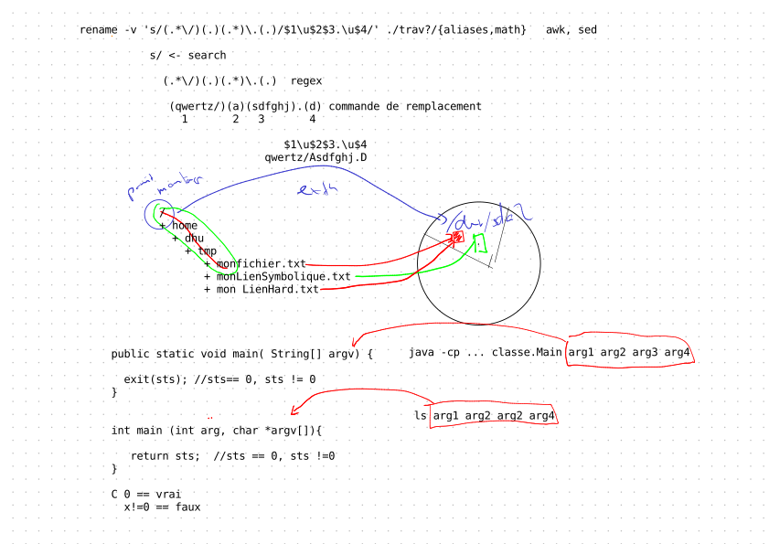

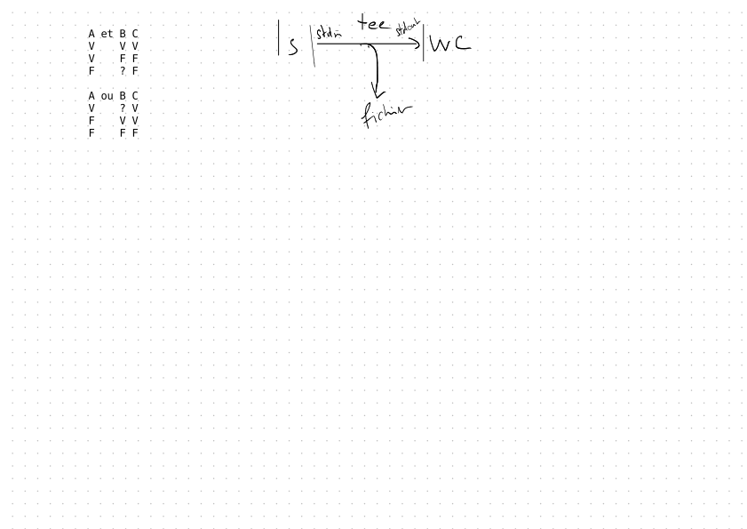

# Leçon 03 - 2026-02-11 (5p)

>Système d'exploitation

## redirection et filtre

* [Le shell](https://mylos.s2.rpn.ch/cours/int-sys1-nix/shell/)
   1. [Activités, série 0003 - Redirection et filtre](https://mylos.s2.rpn.ch/cours/int-sys1-nix/activites/sysnix-activite-0003-redirection-filtre/) 
      * correction 
      * [Éléments de solution](elements-de-solution/sysnix-activite-0003-redirection-filtre)
   1. [Fiches - Rôle de l'apostrophe dans la commande `find`](https://mylos.s2.rpn.ch/cours/int-sys1-nix/fiches/shell-find-role-apostrophes/)


## Installation et configuration

* [Mise en place du système d'exploitation](https://mylos.s2.rpn.ch/cours/int-sys1-nix/mise-en-route-systeme-exploitation/)
    * [Gestion des volumes logique LVM](https://mylos.s2.rpn.ch/cours/int-sys1-nix/mise-en-route-systeme-exploitation/volume-logique-lvm/)
    * [Installation GNU/Linux Debian Server](https://mylos.s2.rpn.ch/cours/int-sys1-nix/mise-en-route-systeme-exploitation/linux-installation/)
        * connecter le cable réseau LAB-Px à la place du cable réseau S2-Px. La machine est branché sur le résean lan.dhu
        * démarrer la machine sur la carte réseau (IBA GE SLOT). la touche F8 permet de sélection le périphérique de démarrage.
        * Nom de la machine lmb-b315-dhu  
        * Partitionner le disque
          * utiliser partitionnement tout le disqe avec LVM et faire des changements avant de commencer l'intallation
          * LVM, volume logique root, swap, var, home (optionnel)

>Préparation évaluation : installer le manuel en français.
>```
>sudo apt-get install manpages-fr manpages-fr-dev
>```
>
>* configurer le périphérique réseau
>* sélection la langue du manuel
>   ```
>   dhu:beuseu$ man -L en bash
>   dhu:beuseu$ man -L fr bash
>   ```

### Post-installation

* mettre à jour le système

    ```
    $ sudo apt update
    $ sudo apt upgrade
    ```

* arrêt de la machine

    ```
    $ sudo shutdown now
    ```


## A Faire

* terminer l'[Activités, série 0003 - Redirection et filtre](https://mylos.s2.rpn.ch/cours/int-sys1-nix/activites/sysnix-activite-0003-redirection-filtre/) 
* A étudier [Gestion des permissions](https://mylos.s2.rpn.ch/cours/int-sys1-nix/shell/gestion-acces/)

## Notes

```
huguenindo@lozan0:tmp$ cat <<_EOF_ > ./ex2.txt
> asddffgg
> qweweer
> dsdsdsd
> 6656566
> _EOF_
huguenindo@lozan0:tmp$ cat ex2.txt 
asddffgg
qweweer
dsdsdsd
6656566
huguenindo@lozan0:tmp$ cat <<pierpoljak > ./ex3.txt
asddffgg
qweweer
dsdsdsd
6656566
pierpoljak 


huguenindo@lozan0:tmp$ cat /etc/passwd| cut -d: -f1,4 | grep 3
sys:3
sync:65534
proxy:13
www-data:33
backup:34
list:38
irc:39
_apt:65534
nobody:65534
sshd:65534
ferrarip:1003
gerbert3:1020
marquesrda1:1030
merillata:1031
sampaolof1:1032
bastosda1:1033
borcardj:1034
cattarinn1:1035
dilke:1036
germaniertr:1037
hazerajh:1038
mafillem:1043
kneubuehlv:1053
huguenindo@lozan0:tmp$ cat /etc/passwd| cut -d: -f1,4 | grep :3
sys:3
www-data:33
backup:34
list:38
irc:39
huguenindo@lozan0:tmp$ cat /etc/passwd| cut -d: -f1,4 | grep :3$
sys:3
huguenindo@lozan0:tmp$ cat /etc/passwd| cut -d: -f1,4 | grep 3$
sys:3
proxy:13
www-data:33
ferrarip:1003
bastosda1:1033
mafillem:1043
kneubuehlv:1053
huguenindo@lozan0:tmp$ cat /etc/passwd| cut -d: -f1,4 | grep :3$
sys:3

huguenindo@lozan0:tmp$ cut -d: -f1,6 /etc/passwd
root:/root
daemon:/usr/sbin
bin:/bin
sys:/dev
sync:/bin
games:/usr/games
man:/var/cache/man
lp:/var/spool/lpd
mail:/var/mail
news:/var/spool/news
uucp:/var/spool/uucp
proxy:/bin
www-data:/var/www
backup:/var/backups
list:/var/list
irc:/run/ircd
_apt:/nonexistent
nobody:/nonexistent
messagebus:/nonexistent
systemd-network:/
systemd-resolve:/
polkitd:/nonexistent
admin:/home/admin
sshd:/run/sshd
consul:/home/consul
prometheus:/var/lib/prometheus
uuidd:/run/uuidd
huguenindo:/home/huguenindo
jaeggil:/home/jaeggil
ferrarip:/home/ferrarip
eltschingera:/home/eltschingera
riederl1:/home/riederl1
wohlhauserfa:/home/wohlhauserfa
sacchettip:/home/sacchettip
gonthierc:/home/gonthierc
bouquetr1:/home/bouquetr1
barraudqu:/home/barraudqu
devantheyj:/home/devantheyj
gerbert3:/home/gerbert3
koggalamt2:/home/koggalamt2
haussenero:/home/haussenero
marquesrda1:/home/marquesrda1
merillata:/home/merillata
sampaolof1:/home/sampaolof1
bastosda1:/home/bastosda1
borcardj:/home/borcardj
cattarinn1:/home/cattarinn1
dilke:/home/dilke
germaniertr:/home/germaniertr
hazerajh:/home/hazerajh
mafillem:/home/mafillem
nothj:/home/nothj
stuckia1:/home/stuckia1
barzaghim1:/home/barzaghim1
brossardl1:/home/brossardl1
deojt:/home/deojt
faivrel:/home/faivrel
geiserj:/home/geiserj
henochrjt:/home/henochrjt
kilchert1:/home/kilchert1
kneubuehlv:/home/kneubuehlv
maurerr1:/home/maurerr1
pachoude1:/home/pachoude1
sejdio1:/home/sejdio1
zeinalovd:/home/zeinalovd
huguenindo@lozan0:tmp$ cut -d: -f1,6 < /etc/passwd
root:/root
daemon:/usr/sbin
bin:/bin
sys:/dev
sync:/bin
games:/usr/games
man:/var/cache/man
lp:/var/spool/lpd
mail:/var/mail
news:/var/spool/news
uucp:/var/spool/uucp
proxy:/bin
www-data:/var/www
backup:/var/backups
list:/var/list
irc:/run/ircd
_apt:/nonexistent
nobody:/nonexistent
messagebus:/nonexistent
systemd-network:/
systemd-resolve:/
polkitd:/nonexistent
admin:/home/admin
sshd:/run/sshd
consul:/home/consul
prometheus:/var/lib/prometheus
uuidd:/run/uuidd
huguenindo:/home/huguenindo
jaeggil:/home/jaeggil
ferrarip:/home/ferrarip
eltschingera:/home/eltschingera
riederl1:/home/riederl1
wohlhauserfa:/home/wohlhauserfa
sacchettip:/home/sacchettip
gonthierc:/home/gonthierc
bouquetr1:/home/bouquetr1
barraudqu:/home/barraudqu
devantheyj:/home/devantheyj
gerbert3:/home/gerbert3
koggalamt2:/home/koggalamt2
haussenero:/home/haussenero
marquesrda1:/home/marquesrda1
merillata:/home/merillata
sampaolof1:/home/sampaolof1
bastosda1:/home/bastosda1
borcardj:/home/borcardj
cattarinn1:/home/cattarinn1
dilke:/home/dilke
germaniertr:/home/germaniertr
hazerajh:/home/hazerajh
mafillem:/home/mafillem
nothj:/home/nothj
stuckia1:/home/stuckia1
barzaghim1:/home/barzaghim1
brossardl1:/home/brossardl1
deojt:/home/deojt
faivrel:/home/faivrel
geiserj:/home/geiserj
henochrjt:/home/henochrjt
kilchert1:/home/kilchert1
kneubuehlv:/home/kneubuehlv
maurerr1:/home/maurerr1
pachoude1:/home/pachoude1
sejdio1:/home/sejdio1
zeinalovd:/home/zeinalovd
huguenindo@lozan0:tmp$ cat < /etc/passwd | cut -d: -f1,6
root:/root
daemon:/usr/sbin
bin:/bin
sys:/dev
sync:/bin
games:/usr/games
man:/var/cache/man
lp:/var/spool/lpd
mail:/var/mail
news:/var/spool/news
uucp:/var/spool/uucp
proxy:/bin
www-data:/var/www
backup:/var/backups
list:/var/list
irc:/run/ircd
_apt:/nonexistent
nobody:/nonexistent
messagebus:/nonexistent
systemd-network:/
systemd-resolve:/
polkitd:/nonexistent
admin:/home/admin
sshd:/run/sshd
consul:/home/consul
prometheus:/var/lib/prometheus
uuidd:/run/uuidd
huguenindo:/home/huguenindo
jaeggil:/home/jaeggil
ferrarip:/home/ferrarip
eltschingera:/home/eltschingera
riederl1:/home/riederl1
wohlhauserfa:/home/wohlhauserfa
sacchettip:/home/sacchettip
gonthierc:/home/gonthierc
bouquetr1:/home/bouquetr1
barraudqu:/home/barraudqu
devantheyj:/home/devantheyj
gerbert3:/home/gerbert3
koggalamt2:/home/koggalamt2
haussenero:/home/haussenero
marquesrda1:/home/marquesrda1
merillata:/home/merillata
sampaolof1:/home/sampaolof1
bastosda1:/home/bastosda1
borcardj:/home/borcardj
cattarinn1:/home/cattarinn1
dilke:/home/dilke
germaniertr:/home/germaniertr
hazerajh:/home/hazerajh
mafillem:/home/mafillem
nothj:/home/nothj
stuckia1:/home/stuckia1
barzaghim1:/home/barzaghim1
brossardl1:/home/brossardl1
deojt:/home/deojt
faivrel:/home/faivrel
geiserj:/home/geiserj
henochrjt:/home/henochrjt
kilchert1:/home/kilchert1
kneubuehlv:/home/kneubuehlv
maurerr1:/home/maurerr1
pachoude1:/home/pachoude1
sejdio1:/home/sejdio1
zeinalovd:/home/zeinalovd

huguenindo@lozan0:tmp$ ls -l
total 16
-rw-r--r-- 1 huguenindo huguenindo    0 11 fév 08:52 ex1
-rw-r--r-- 1 huguenindo huguenindo    0 11 fév 08:52 ex2
-rw-r--r-- 1 huguenindo huguenindo   33 11 fév 07:50 ex2.txt
-rw-r--r-- 1 huguenindo huguenindo    0 11 fév 08:52 ex3
-rw-r--r-- 1 huguenindo huguenindo   33 11 fév 07:50 ex3.txt
-rw-r--r-- 1 huguenindo huguenindo    0 11 fév 08:52 ex4
-rw-r--r-- 1 huguenindo huguenindo    0 11 fév 08:52 ex5
-rw-r--r-- 1 huguenindo huguenindo    0 11 fév 08:52 ex6
---x--x--x 1 huguenindo huguenindo    0 11 fév 08:52 ex7
-rw-r--r-- 1 huguenindo huguenindo    0 11 fév 08:52 ex8
-rw-r--r-- 1 huguenindo huguenindo    0 11 fév 08:52 ex9
-rw-r--r-- 1 huguenindo huguenindo 1239 11 fév 07:35 include.txt
-rw-r--r-- 1 huguenindo huguenindo 1437 11 fév 08:40 liste_comptes
huguenindo@lozan0:tmp$ find . -name 'ex*'
./ex7
./ex8
./ex1
./ex4
./ex5
./ex2.txt
./ex3
./ex9
./ex2
./ex3.txt
./ex6
huguenindo@lozan0:tmp$ find . -name ex*
find: paths must precede expression: `ex2'
find: possible unquoted pattern after predicate `-name'?
huguenindo@lozan0:tmp$ set -x
huguenindo@lozan0:tmp$ find . -name 'ex*'
+ find . -name 'ex*'
./ex7
./ex8
./ex1
./ex4
./ex5
./ex2.txt
./ex3
./ex9
./ex2
./ex3.txt
./ex6
huguenindo@lozan0:tmp$ find . -name ex*
+ find . -name ex1 ex2 ex2.txt ex3 ex3.txt ex4 ex5 ex6 ex7 ex8 ex9
find: paths must precede expression: `ex2'
find: possible unquoted pattern after predicate `-name'?
huguenindo@lozan0:tmp$ find . -perm -111
+ find . -perm -111
.
./ex7
huguenindo@lozan0:tmp$ set +x
+ set +x
huguenindo@lozan0:tmp$ find . -perm -111
.
./ex7
huguenindo@lozan0:tmp$ find . -perm 111
./ex7

huguenindo@lozan0:tmp$ find . -perm -u=x,g=x,o=x
.
./ex7
huguenindo@lozan0:tmp$ find . -perm u=x,g=x,o=x
./ex7
huguenindo@lozan0:tmp$ find . -perm u=x,g=,o=x
huguenindo@lozan0:tmp$ find . -perm -u=x,g=,o=x
.
./ex7

```

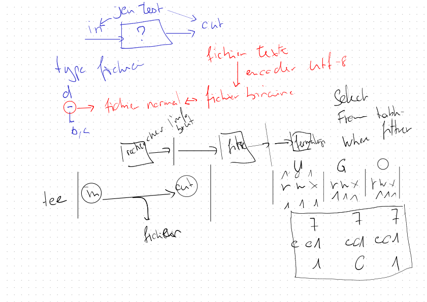

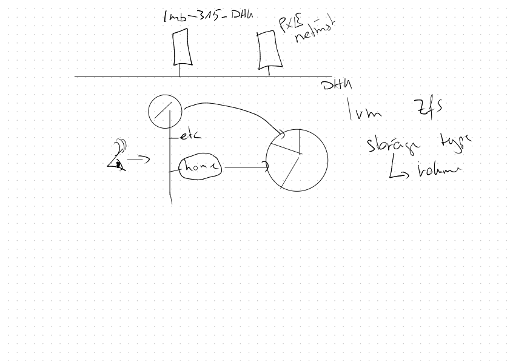


# Leçon 04 - 2026-02-18 (5p)

## disque système de remplacement

1. HD-S-604
1. HD-S-459
1. HD-S-629

## A voir

1. configuration du prompt
1. ascinema

## redirection et filtre

* [Le shell](https://mylos.s2.rpn.ch/cours/int-sys1-nix/shell/)
   1. [Activités, série 0003 - Redirection et filtre](https://mylos.s2.rpn.ch/cours/int-sys1-nix/activites/sysnix-activite-0003-redirection-filtre/) 
      * finir la correction de 7 à la fin
      * [Éléments de solution](elements-de-solution/sysnix-activite-0003-redirection-filtre)
   1. [Fiches - Rôle de l'apostrophe dans la commande `find`](https://mylos.s2.rpn.ch/cours/int-sys1-nix/fiches/shell-find-role-apostrophes/)

## Couche graphique

* [Installation du serveur X](https://mylos.s2.rpn.ch/cours/int-sys1-nix/mise-en-route-systeme-exploitation/how-to-ubuntu-x/)
* [Utilisation d'une application graphique en réseau](https://mylos.s2.rpn.ch/cours/int-sys1-nix/mise-en-route-systeme-exploitation/linux-couche-graphique-reseau/)

>Sur Ubuntu Server 22.04, tu peux lancer une application avec startx <application> si tu as installé xterm.
> 
>Quelques exemples qui fonctionnent très bien (après installation des paquets correspondants) :
>* `startx xclock`
>* `startx xeyes`
>* `startx midori`
>* `startx nautilus`
>
>Un bon moyen de montrer qu’on n’a besoin de rien ou presque pour lancer une application graphique !

## configuration réseau (network/interfaces)

* activer le network-manager en commentant les lignes dans le fichier /etc/network/interfaces correspondant à la carte réseau puis redémarrer la machine

```
# This file describes the network interfaces available on your system
# and how to activate them. For more information, see interfaces(5).

source /etc/network/interfaces.d/*

# The loopback network interface
auto lo
iface lo inet loopback

# The primary network interface
#allow-hotplug enp5s0
#iface enp5s0 inet dhcp
```

## configuration réseau (netplan)

* activer le network-manager

    ```
    huguenindo@mc0-0315-00:~$ cat /etc/netplan/01-netcfg.yaml 
    # Let NetworkManager manage all devices on this system
    network:
        version: 2
        renderer: NetworkManager

    huguenindo@mc0-0315-00:~$ sudo netplan apply  
    ```

    rebooter la machine

## Accès à Lozan

* Configurer l'accès ssh à lozan depuis la machine lmb-315-dhu

## gameshell

1. la mission 18 nécessite un serveur X coté client!

  ```
  gsh index
  gsh goal 18
  ```

## Gestion des permissions

* [Le shell](https://mylos.s2.rpn.ch/cours/int-sys1-nix/shell/)
   1. [Gestion des permissions](https://mylos.s2.rpn.ch/cours/int-sys1-nix/shell/gestion-acces/)
      * question?
   1. [Activités, série 0004 - Gestion des accès](https://mylos.s2.rpn.ch/cours/int-sys1-nix/activites/sysnix-activite-0004-gestion-acces/)

## A Faire


* étudier la solution [Activités, série 0003 - Redirection et filtre - Éléments de solution](elements-de-solution/sysnix-activite-0003-redirection-filtre)
* A étudier [Gestion des permissions](https://mylos.s2.rpn.ch/cours/int-sys1-nix/shell/gestion-acces/)
* Terminer [Activités, série 0004 - Gestion des accès](https://mylos.s2.rpn.ch/cours/int-sys1-nix/activites/sysnix-activite-0004-gestion-acces/)

## Notes

```
huguenindo@lozan0:tmp$ tree
.
├── ex1
├── ex2
├── ex3
├── ex4
├── ex5
├── ex6
├── ex7
├── ex8
├── ex9
└── test
    ├── fichier1
    ├── fichier2
    ├── fichier3
    ├── fichier4
    ├── fichier5
    ├── fichier6
    ├── fichier7
    ├── fichier8
    └── fichier9

2 directories, 18 files
huguenindo@lozan0:tmp$ find . -name '*' | wc -l
20
huguenindo@lozan0:tmp$ find . | wc -l
20
huguenindo@lozan0:tmp$ find . -type f | wc -l
18
huguenindo@lozan0:tmp$ man tree 
huguenindo@lozan0:tmp$ tree -p
[drwxr-xr-x]  .
├── [-rw-r--r--]  ex1
├── [-rw-r--r--]  ex2
├── [-rw-r--r--]  ex3
├── [-rw-r--r--]  ex4
├── [-rw-r--r--]  ex5
├── [-rw-r--r--]  ex6
├── [-rw-r--r--]  ex7
├── [-rw-r--r--]  ex8
├── [-rw-r--r--]  ex9
└── [drwxr-xr-x]  test
    ├── [-rw-r--r--]  fichier1
    ├── [-rw-r--r--]  fichier2
    ├── [-rw-r--r--]  fichier3
    ├── [-rw-r--r--]  fichier4
    ├── [-rw-r--r--]  fichier5
    ├── [-rw-r--r--]  fichier6
    ├── [-rw-r--r--]  fichier7
    ├── [-rw-r--r--]  fichier8
    └── [-rw-r--r--]  fichier9

2 directories, 18 files
huguenindo@lozan0:tmp$ cat /etc/passwd | cut -d: -f4 | grep ^1[0-9][0-9]$
101
107
108
huguenindo@lozan0:tmp$ cat /etc/passwd | cut -d: -f4 | grep ^1[0-9][0-9]
101
1000
107
108
1001
1002
1003
1004
1005
1006
1007
1008
1017
1018
1019
1020
1021
1029
1030
1031
1032
1033
1034
1035
1036
1037
1038
1043
1044
1045
1046
1047
1048
1049
1050
1051
1052
1053
1054
1055
1057
1059
huguenindo@lozan0:tmp$ cat /etc/passwd | cut -d: -f4 | grep 1[0-9][0-9]$
101
107
108
huguenindo@lozan0:tmp$ cat /etc/passwd | cut -d: -f4 | grep 1[0-9][0-9]
101
1000
107
108
1001
1002
1003
1004
1005
1006
1007
1008
1017
1018
1019
1020
1021
1029
1030
1031
1032
1033
1034
1035
1036
1037
1038
1043
1044
1045
1046
1047
1048
1049
1050
1051
1052
1053
1054
1055
1057
1059
huguenindo@lozan0:tmp$ 
huguenindo@lozan0:tmp$ w
 07:54:42 up 104 days, 17:27,  3 users,  load average: 0.00, 0.01, 0.00
UTIL.    TTY      DE               LOGIN@   IDLE   JCPU   PCPU QUOI
geiserj  pts/0    172.16.1.10      07:23    2:16   0.03s  0.03s -bash
huguenin pts/1    172.16.1.10      07:33    1.00s  0.08s  0.02s w
maurerr1 pts/2    172.16.1.10      07:49    4:33   0.01s  0.01s -bash
huguenindo@lozan0:tmp$ w | tr -s ' ' ':'
:07:55:54:up:104:days,:17:29,:3:users,:load:average:0.07,:0.04,:0.01
UTIL.:TTY:DE:LOGIN@:IDLE:JCPU:PCPU:QUOI
geiserj:pts/0:172.16.1.10:07:23:2.00s:0.04s:0.04s:-bash
huguenin:pts/1:172.16.1.10:07:33:2.00s:0.08s:0.01s:w
maurerr1:pts/2:172.16.1.10:07:49:5:45:0.01s:0.01s:-bash
huguenindo@lozan0:tmp$ w | tr -s ' ' ':' | cut -d: -f1

UTIL.
geiserj
huguenin
maurerr1
huguenindo@lozan0:tmp$ w | tr -s ' ' ':' | cut -d: -f2
07
TTY
pts/0
pts/1
pts/2
huguenindo@lozan0:tmp$ w | tr -s ' ' ':' | cut -d: -f3
56
DE
172.16.1.10
172.16.1.10
172.16.1.10
huguenindo@lozan0:tmp$ w | tr -s ' ' ':' | cut -d: -f1,3
:56
UTIL.:DE
geiserj:172.16.1.10
huguenin:172.16.1.10
maurerr1:172.16.1.10
huguenindo@lozan0:tmp$ w | tr -s ' ' ':' | cut -d: -f1,3 | head -n 2
:57
UTIL.:DE
huguenindo@lozan0:tmp$ w | tr -s ' ' ':' | cut -d: -f1,3 | tail -2
huguenin:172.16.1.10
maurerr1:172.16.1.10
huguenindo@lozan0:tmp$ w | grep 'pts/2' | tr -s ' ' ':' | cut -d: -f1,3 | tail -2
maurerr1:172.16.1.10
huguenindo@lozan0:tmp$ w | awk '{print $1 " " $3}'
07:59:12 104
UTIL. DE
geiserj 172.16.1.10
huguenin 172.16.1.10
maurerr1 172.16.1.10
huguenindo@lozan0:tmp$ w | awk '{print $1 " " $3}' | tail -n 2
huguenin 172.16.1.10
maurerr1 172.16.1.10
huguenindo@lozan0:tmp$ w | awk '{print $1 " " $4}' | tail -n 2
huguenin 07:33
maurerr1 07:49
huguenindo@lozan0:tmp$ w | awk '{print $1 " " $5}' | tail -n 2
huguenin 4.00s
maurerr1 9:58
huguenindo@lozan0:tmp$ w | awk '{print $1 " " $6}' | tail -n 2
huguenin 0.12s
maurerr1 0.01s
huguenindo@lozan0:tmp$ w | awk '{print $1 " " $7}' | tail -n 2
huguenin 0.01s
maurerr1 0.01s
huguenindo@lozan0:tmp$ w | awk '{print $1 " " $8}' | tail -n 2
huguenin w
maurerr1 -bash
huguenindo@lozan0:tmp$ man awk
huguenindo@lozan0:tmp$ man sed
huguenindo@lozan0:tmp$ tty
/dev/pts/1
huguenindo@lozan0:tmp$ cat > /dev/pts/1
aaaaa
aaaaa
aaaa
aaaa
aaa
aaa
```

## find -name avec ou sans apostrophe (')

```
huguenindo@lozan0:tmp$ rm -R *
huguenindo@lozan0:tmp$ find  /usr/include -name al*.h
/usr/include/c++/12/bits/allocator.h
/usr/include/c++/12/bits/allocated_ptr.h
/usr/include/c++/12/bits/alloc_traits.h
/usr/include/c++/12/bits/align.h
/usr/include/c++/12/bits/algorithmfwd.h
/usr/include/c++/12/ext/aligned_buffer.h
/usr/include/c++/12/ext/alloc_traits.h
/usr/include/c++/12/parallel/algo.h
/usr/include/c++/12/parallel/algorithmfwd.h
/usr/include/c++/12/parallel/algobase.h
/usr/include/c++/12/pstl/algorithm_impl.h
/usr/include/c++/12/pstl/algorithm_fwd.h
/usr/include/alloca.h
/usr/include/aliases.h
huguenindo@lozan0:tmp$ find  /usr/include -name 'al*.h'
/usr/include/c++/12/bits/allocator.h
/usr/include/c++/12/bits/allocated_ptr.h
/usr/include/c++/12/bits/alloc_traits.h
/usr/include/c++/12/bits/align.h
/usr/include/c++/12/bits/algorithmfwd.h
/usr/include/c++/12/ext/aligned_buffer.h
/usr/include/c++/12/ext/alloc_traits.h
/usr/include/c++/12/parallel/algo.h
/usr/include/c++/12/parallel/algorithmfwd.h
/usr/include/c++/12/parallel/algobase.h
/usr/include/c++/12/pstl/algorithm_impl.h
/usr/include/c++/12/pstl/algorithm_fwd.h
/usr/include/alloca.h
/usr/include/aliases.h
huguenindo@lozan0:tmp$ set -x
huguenindo@lozan0:tmp$ find  /usr/include -name 'al*.h'
+ find /usr/include -name 'al*.h'
/usr/include/c++/12/bits/allocator.h
/usr/include/c++/12/bits/allocated_ptr.h
/usr/include/c++/12/bits/alloc_traits.h
/usr/include/c++/12/bits/align.h
/usr/include/c++/12/bits/algorithmfwd.h
/usr/include/c++/12/ext/aligned_buffer.h
/usr/include/c++/12/ext/alloc_traits.h
/usr/include/c++/12/parallel/algo.h
/usr/include/c++/12/parallel/algorithmfwd.h
/usr/include/c++/12/parallel/algobase.h
/usr/include/c++/12/pstl/algorithm_impl.h
/usr/include/c++/12/pstl/algorithm_fwd.h
/usr/include/alloca.h
/usr/include/aliases.h
huguenindo@lozan0:tmp$ find  /usr/include -name al*.h
+ find /usr/include -name 'al*.h'
/usr/include/c++/12/bits/allocator.h
/usr/include/c++/12/bits/allocated_ptr.h
/usr/include/c++/12/bits/alloc_traits.h
/usr/include/c++/12/bits/align.h
/usr/include/c++/12/bits/algorithmfwd.h
/usr/include/c++/12/ext/aligned_buffer.h
/usr/include/c++/12/ext/alloc_traits.h
/usr/include/c++/12/parallel/algo.h
/usr/include/c++/12/parallel/algorithmfwd.h
/usr/include/c++/12/parallel/algobase.h
/usr/include/c++/12/pstl/algorithm_impl.h
/usr/include/c++/12/pstl/algorithm_fwd.h
/usr/include/alloca.h
/usr/include/aliases.h
huguenindo@lozan0:tmp$ touch al123456789.h
+ touch al123456789.h
huguenindo@lozan0:tmp$ ls
+ ls --color=auto
al123456789.h
huguenindo@lozan0:tmp$ find  /usr/include -name 'al*.h'
+ find /usr/include -name 'al*.h'
/usr/include/c++/12/bits/allocator.h
/usr/include/c++/12/bits/allocated_ptr.h
/usr/include/c++/12/bits/alloc_traits.h
/usr/include/c++/12/bits/align.h
/usr/include/c++/12/bits/algorithmfwd.h
/usr/include/c++/12/ext/aligned_buffer.h
/usr/include/c++/12/ext/alloc_traits.h
/usr/include/c++/12/parallel/algo.h
/usr/include/c++/12/parallel/algorithmfwd.h
/usr/include/c++/12/parallel/algobase.h
/usr/include/c++/12/pstl/algorithm_impl.h
/usr/include/c++/12/pstl/algorithm_fwd.h
/usr/include/alloca.h
/usr/include/aliases.h
huguenindo@lozan0:tmp$ find  /usr/include -name al*.h
+ find /usr/include -name al123456789.h
huguenindo@lozan0:tmp$ ls 'al*.h'
+ ls --color=auto 'al*.h'
ls: impossible d'accéder à 'al*.h': Aucun fichier ou dossier de ce type
huguenindo@lozan0:tmp$ ls al*.h
+ ls --color=auto al123456789.h
al123456789.h
huguenindo@lozan0:tmp$ touch 'al*.h'
+ touch 'al*.h'
huguenindo@lozan0:tmp$ ls al*.h
+ ls --color=auto al123456789.h 'al*.h'
 al123456789.h  'al*.h'
huguenindo@lozan0:tmp$ ls 'al*.h'
+ ls --color=auto 'al*.h'
'al*.h'
huguenindo@lozan0:tmp$ ls 'al   *.h'
+ ls --color=auto 'al   *.h'
ls: impossible d'accéder à 'al   *.h': Aucun fichier ou dossier de ce type
huguenindo@lozan0:tmp$ touch 'al   1.h'
+ touch 'al   1.h'
huguenindo@lozan0:tmp$ ls
+ ls --color=auto
 al123456789.h  'al   1.h'  'al*.h'


```

### Réponse de gemini

C'est un classique du shell ! Ce que tu observes est le résultat d'un mécanisme appelé le **Globbing** (ou expansion des métacaractères) effectué par ton shell (Bash, Zsh, etc.) **avant** même que la commande `find` ne soit exécutée.

Voici l'explication étape par étape de ce qui s'est passé dans ton terminal :

---

### 1. Pourquoi la première commande fonctionne ?

```bash
find /usr/include -name al*.h

```

À ce moment-là, ton dossier actuel (`tmp`) est vide (ou ne contient aucun fichier commençant par "al" et finissant par ".h").

* Le shell cherche dans le répertoire courant s'il y a un fichier qui correspond à `al*.h`.
* Il n'en trouve pas.
* **Comportement par défaut :** S'il n'y a pas de correspondance, le shell laisse la chaîne `al*.h` telle quelle et la transmet à `find`.
* `find` reçoit donc bien l'argument `-name al*.h` et cherche récursivement dans `/usr/include`.

### 2. L'élément perturbateur : `touch al123456789.h`

Tu viens de créer un fichier qui correspond exactement au motif `al*.h` dans ton répertoire de travail actuel.

### 3. Le piège de la dernière commande

```bash
find /usr/include -name al*.h

```

Ici, avant de lancer `find`, le shell analyse la ligne. Il voit `al*.h`, regarde dans le dossier courant, et se dit : *"Tiens ! J'ai un fichier qui correspond : al123456789.h"*.

Le shell **remplace** alors ton texte par le nom du fichier trouvé. La commande réellement exécutée devient :
`find /usr/include -name al123456789.h`

Comme ce fichier précis n'existe pas dans `/usr/include` (il n'existe que dans ton dossier `tmp`), `find` ne renvoie rien ou presque rien.

---

### La règle d'or pour `find`

Pour éviter que le shell n'interprète les astérisques (`*`) à ta place, il faut **toujours mettre le motif entre guillemets**.

| Commande | Risque |
| --- | --- |
| `find . -name *.h` | **Dangereux** : Le shell peut remplacer `*.h` par les fichiers du dossier local. |
| `find . -name "*.h"` | **Sûr** : Le shell ignore l'astérisque, et c'est `find` qui l'interprète. |

C'est d'ailleurs ce que tu as fait dans ton avant-dernière commande (`find /usr/include -name 'al*.h'`), et c'est pour cela qu'elle a fonctionné correctement malgré la présence du fichier dans ton dossier.

Souhaites-tu que je t'explique comment désactiver temporairement ce comportement du shell (le globbing) pour tes tests ?


# Leçon 05 - 2026-03-04 (5p)

* [Le shell](https://mylos.s2.rpn.ch/cours/int-sys1-nix/shell/)
   1. [Gestion des permissions](https://mylos.s2.rpn.ch/cours/int-sys1-nix/shell/gestion-acces/)
      * question?
   1. [Activités, série 0004 - Gestion des accès](https://mylos.s2.rpn.ch/cours/int-sys1-nix/activites/sysnix-activite-0004-gestion-acces/)
   1. [Gestion des utilisateurs et des groupes](https://mylos.s2.rpn.ch/cours/int-sys1-nix/mise-en-route-systeme-exploitation/user-group/)
      * Création d'un utilisateur guest manuellement   
      * ajouter l'utilisateur guest dans votre groupe initial

        ```
        huguenindo@debian-usb:~$ id guest
        uid=1002(guest) gid=1002(guest) groupes=1002(guest),100(users)
        huguenindo@debian-usb:~$ sudo adduser guest huguenindo
        Ajout de l'utilisateur « guest » au groupe « huguenindo » ...
        Fait.
        huguenindo@debian-usb:~$ id guest
        uid=1002(guest) gid=1002(guest) groupes=1002(guest),100(users),1000(huguenindo)
        ```

## Script

* [Script Bash](https://mylos.s2.rpn.ch/cours/int-sys1-nix/shell/bash-script/)
    * [Bash, commandes internes](https://mylos.s2.rpn.ch/cours/int-sys1-nix/shell/bash-builtin/)
    * [Langage de programmation Bash](https://mylos.s2.rpn.ch/cours/int-sys1-nix/shell/bash-script-langage/)
* [Activités, série 0006 - Script](https://mylos.s2.rpn.ch/cours/int-sys1-nix/activites/sysnix-activite-0006-script/)

>Vérifier la syntax des script avec shellcheck
>
>```
>$ sudo apt install shellcheck
>```
>


## A faire

1. terminer `Application des permissions` [Activités, série 0004 - Gestion des accès](https://mylos.s2.rpn.ch/cours/int-sys1-nix/activites/sysnix-activite-0004-gestion-acces/)
1. faire l'[Activités, série 0006 - Script](https://mylos.s2.rpn.ch/cours/int-sys1-nix/activites/sysnix-activite-0006-script/)
    1. faire les scripts suivant:
        1. Table de multiplication
        1. Carré de multiplication
        1. Génération d’un projet en java

**1h max**

>Pensez au Here Document https://tldp.org/LDP/abs/html/here-docs.html

## Notes


# Leçon 06 - 2026-03-11 (5p)

>virtualisation - kvm

>Système d'exploitation

## Virtualisation kvm

* [Debian -- Obtenir Debian](https://www.debian.org/distrib/)
    * distribuer les archives contenues sur la clé usb
* [SYSNIX - Virtualisation](https://mylos.s2.rpn.ch/cours/int-sys1-nix/virtualisation/)
    * [Virtualisation - Éléments théoriques](https://mylos.s2.rpn.ch/cours/int-sys1-nix/virtualisation/virtualisation-theorie/)
    * [Virtualisation - Kernel-based Virtual Machine (KVM))](https://mylos.s2.rpn.ch/cours/int-sys1-nix/virtualisation/virtualisation-kvm/)
    * [Virtualisation - libvirt+KVM, installation et configuration](https://mylos.s2.rpn.ch/cours/int-sys1-nix/virtualisation/virtualisation-kvm-libvirt/)

#### Envoyer des combinaisons de touches \<CTRL>\<ALT>\<F1>

* https://askubuntu.com/questions/54814/how-can-i-ctrl-alt-f-to-get-to-a-tty-in-a-qemu-session

    ```
    <CTRL><ALT><2>

    (qemu) sendkey ctrl-alt-f1

    <CTRL><ALT><1>
    ```

## Manipulation

* vidéo [Virtualisation, Création d'une machine virtuelle Debian 12 avec qemu](https://mylos.s2.rpn.ch/cours/int-sys1-nix/fiches/virtualisation-qemu/) 
* vidéo [Virtualisation, création d'une machine virtuelle Debian 12 avec libvirt](https://mylos.s2.rpn.ch/cours/int-sys1-nix/fiches/virtualisation-libvirt/) 
* vidéo [Virtualisation, création d'une machine virtuelle Debian 12 avec virt-manager](https://mylos.s2.rpn.ch/cours/int-sys1-nix/fiches/virtualisation-virt-manager/) 

## Gestion des utilisateurs

* [Mise en place du système d'exploitation](https://mylos.s2.rpn.ch/cours/int-sys1-nix/mise-en-route-systeme-exploitation/)
   1. [Gestion des utilisateurs et des groupes](https://mylos.s2.rpn.ch/cours/int-sys1-nix/mise-en-route-systeme-exploitation/user-group/)
   1. [Activités, série 0008 - Gestion des utilisateurs](https://mylos.s2.rpn.ch/cours/int-sys1-nix/activites/sysnix-activite-0008-gestion-utilisateurs/)


## A Faire

1. terminer `Application des permissions` [Activités, série 0004 - Gestion des accès](https://mylos.s2.rpn.ch/cours/int-sys1-nix/activites/sysnix-activite-0004-gestion-acces/)
1. [Activités, série 0006 - Script](https://mylos.s2.rpn.ch/cours/int-sys1-nix/activites/sysnix-activite-0006-script/)
    1. Valider avec `shellcheck` les convention de codage des scripts
1. [Activités, série 0008 - Gestion des utilisateurs](https://mylos.s2.rpn.ch/cours/int-sys1-nix/activites/sysnix-activite-0008-gestion-utilisateurs/)
    1. terminer la série

## Notes

* https://anthropic.skilljar.com/

* activation du réseau default
```
uguenindo@debian-usb:tmp$ virsh -c qemu:///system
Bienvenue dans virsh, le terminal de virtualisation interactif.

Taper :  « help » pour l’aide ou « help » avec la commande
         « quit » pour quitter

virsh # net-list --all
 Nom       État    Démarrage automatique   Persistent
-------------------------------------------------------
 default   inactif   Non                     Oui

virsh # net-start default

virsh # net-list --all
 Nom       État    Démarrage automatique   Persistent
-------------------------------------------------------
 default   actif   Non                      Oui

virsh # net-autostart default
Réseau default marqué en démarrage automatique

virsh # net-list
 Nom       État    Démarrage automatique   Persistent
-------------------------------------------------------
 default   actif   Oui                     Oui
```

```
$ virt-install --connect qemu:///system \
   -n vm1 \
   -r 1024 \
   --disk path=/tmp/vm1disk.img,format=raw,bus=virtio,size=4 \
   -c /tmp/debian-13.3.0-amd64-netinst.iso \
   --network network=default,model=virtio \
   --osinfo name=debian11 
```

* installation dans une console 
  ```
  huguenindo@debian-usb:tmp$ virt-install --connect qemu:///system \
    -n vm1 \
    -r 1024 \
    --disk path=./vm1disk.img,format=raw,bus=virtio,size=6 \
    --location ~/iso/debian-13.3.0-amd64-netinst.iso \
    --network network=default,model=virtio \
    --osinfo name=debian11 \
    --graphics none \
    --console pty,target_type=serial \
    --extra-args "console=ttyS0,115200n8"
  ```

* droit sur  l'arborescence
  ```
  huguenindo@debian-usb:tmp$ tree -dp -L 1 ~
  [drwx--x--x]  /home/huguenindo
  ...
  ├── [drwxr-xr-x]  tmp
  ...
  ```

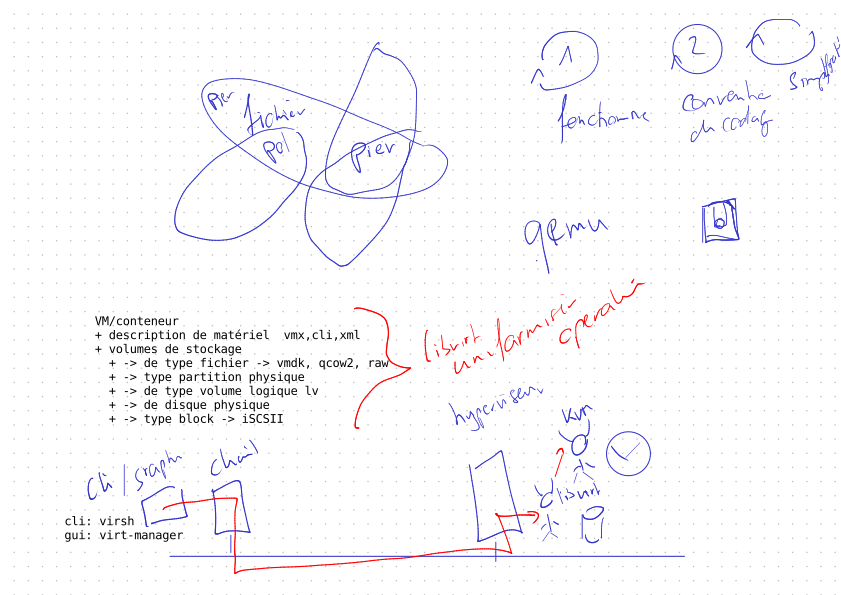

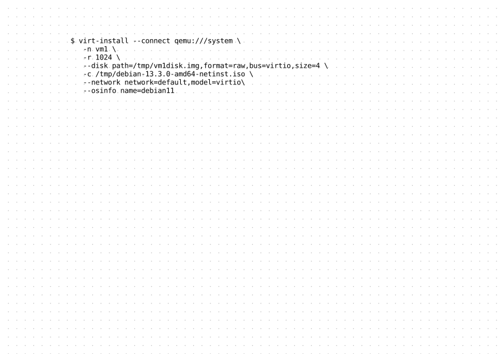

# Leçon 07 - 2026-03-18 (5p)

>virtualisation - kvivm

## Installation du disque bootable

>Dans les préférences de virt-manager, activer l'édition de xml

* [Mise en place du système d'exploitation](https://mylos.s2.rpn.ch/cours/int-sys1-nix/mise-en-route-systeme-exploitation/)
    * rappel des manipulations des volumes logique [Partitionnement avec LVM avant l’installation](https://mylos.s2.rpn.ch/cours/int-sys1-nix/mise-en-route-systeme-exploitation/partitionnement-lvm-avant-installation/)
    * [SYSNIX - Debian 12, création d'un disque externe USB bootable](https://mylos.s2.rpn.ch/cours/int-sys1-nix/fiches/debian-12-disque-externe-bootable/)
* installation du gestionnaire de paquet `synaptic`

    ```
    $ sudo apt install synaptic
    ```

* configurer wifi

  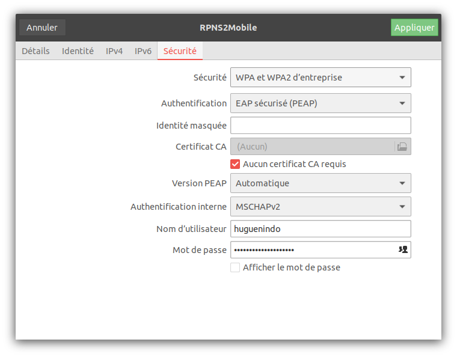

  > installation des paquets permettant de gestion du wifi
  > * wireless-tools  
  > * firmware-iwlwifi : Pour la majorité des cartes Intel.
  > * firmware-realtek : Pour les cartes Realtek (très communes sur portables).
  > * ajouter les dépôt  firmware-linux-nonfree  

* accès à teams via https://onedrive.live.com/login/ ou https://rpns2-my.sharepoint.com


## Gestion des permissions

* [Le shell](https://mylos.s2.rpn.ch/cours/int-sys1-nix/shell/)
   1. Corriger l'[Activités, série 0004 - Gestion des accès](https://mylos.s2.rpn.ch/cours/int-sys1-nix/activites/sysnix-activite-0004-gestion-acces/)
      * [Éléments de solutions](elements-de-solution/sysnix-activite-0004-gestion-acces)

## Gestion des utilisateurs

* [Mise en place du système d'exploitation](https://mylos.s2.rpn.ch/cours/int-sys1-nix/mise-en-route-systeme-exploitation/)
   1. [Activités, série 0008 - Gestion des utilisateurs](https://mylos.s2.rpn.ch/cours/int-sys1-nix/activites/sysnix-activite-0008-gestion-utilisateurs/)

## A Faire

* faire fonctionner le disque USB linux sur vorte ordinateur portable
* terminer [Activités, série 0008 - Gestion des utilisateurs](https://mylos.s2.rpn.ch/cours/int-sys1-nix/activites/sysnix-activite-0008-gestion-utilisateurs/)

# Leçon 08 - 2026-03-25 (5p)

## Gestion des utilisateurs

1. [Activités, série 0008 - Gestion des utilisateurs](https://mylos.s2.rpn.ch/cours/int-sys1-nix/activites/sysnix-activite-0008-gestion-utilisateurs/)
    * [Éléments de solutions](elements-de-solution/sysnix-activite-0008-gestion-utilisateurs)

## Script

* [Activités, série 0006 - Script](https://mylos.s2.rpn.ch/cours/int-sys1-nix/activites/sysnix-activite-0006-script/)

## Exemple de fonction en ligne de commande 

* compte de 1 à 10

  ```bash
  dom@domp14s:tmp$ for i in $(seq 1 10); do echo $i; done
  1
  2
  3
  4
  5
  6
  7
  8
  9
  10
  ```

* déclare la fonction `compteur` permettant de compter de 1 à 10   

  ```bash
  dom@domp14s:tmp$ compteur() { for i in $(seq 1 10); do echo $i; done }
  ```

* appel la fonction `compteur`  

  ```bash
  dom@domp14s:tmp$ compteur
  1
  2
  3
  4
  5
  6
  7
  8
  9
  10
  ```

* affiche la déclaration de la fonction `compteur`

  ```bash
  dom@domp14s:tmp$ type compteur
  compteur est une fonction
  compteur () 
  { 
      for i in $(seq 1 10);
      do
          echo $i;
      done
  }
  ```

* script contenant la fonction `compteur`

  ```bash
  huguenindo@mc0-0315-00:tmp$ cat test.sh 
  #!/bin/bash

  monCompteur() { 
    for i in $(seq 1 ${1}); do 
      echo $i 
    done 
  }

  monCompteur 100
  ```


* déclare une fonction `compteurRecursif` permettant de compter de 1 à 10   

  ```bash
  dom@domp14s:tmp$ compteurRecursif() { i="$1"; if [ -z "$i" ]; then i=1; fi; if [ $i -le 10 ]; then  echo $i ; compteurRecursif $(($i+1)); fi }
  ```

* appel la fonction `compteurRecursif`  

  ```
  dom@domp14s:tmp$ compteurRecursif
  1
  2
  3
  4
  5
  6
  7
  8
  9
  10
  ```

* affiche la déclaration de la fonction `compteurRecursif`

  ```
  dom@domp14s:tmp$ type compteurRecursif
  compteurRecursif est une fonction
  compteurRecursif () 
  { 
      i="$1";
      if [ -z "$i" ]; then
          i=1;
      fi;
      if [ $i -le 10 ]; then
          echo $i;
          compteurRecursif $(($i+1));
      fi
  }
  ```


## Virtualisation kvm

* installation kvm, libvirt sur le système du disque amovible
* [SYSNIX - Virtualisation](https://mylos.s2.rpn.ch/cours/int-sys1-nix/virtualisation/)
    1. [Virtualisation - libvirt+KVM, installation et configuration](https://mylos.s2.rpn.ch/cours/int-sys1-nix/virtualisation/virtualisation-kvm-libvirt/)
        1. Créer 2 VM selon la vidéo [Virtualisation, création d'une machine virtuelle Debian 12 avec libvirt](https://mylos.s2.rpn.ch/cours/int-sys1-nix/fiches/virtualisation-libvirt/) ou la vidéo [Virtualisation, création d'une machine virtuelle Debian 12 avec virt-manager](https://mylos.s2.rpn.ch/cours/int-sys1-nix/fiches/virtualisation-virt-manager/) 
            1. **vm1** *debian trixie*, stockage dans un fichier **raw** de **6G**, partitionnement "**assisté - utiliser un disque entier**"
            1. **vm2** *debian trixie*, stockage dans un fichier **raw** de **6G**, partitionnement "**assisté - utiliser tout un disque avec LVM**"
   1. accès à la vm
      1. [Virtualisation, Activation de l'accès à la console texte de VM KVM](https://mylos.s2.rpn.ch/cours/int-sys1-nix/fiches/virtualisation-console-virsh/)
      1. [Virtualisation, Accès à la VM avec la console ou le client SSH](https://mylos.s2.rpn.ch/cours/int-sys1-nix/fiches/virtualisation-console-vs-ssh/)
   1. [Activités, série 0500 - Libvirt + kvm + lvm](https://mylos.s2.rpn.ch/cours/int-sys1-nix/activites/sysnix-activite-0500-libvirt-kvm-lvm/)
         1. KVM - Cloner
            1. vm1 -> vm1b
      1. KVM - Cloner dans une LV
         1. vm1 -> vm3
         1. vm2 -> vm4


## A faire

* [Activités, série 0006 - Script](https://mylos.s2.rpn.ch/cours/int-sys1-nix/activites/sysnix-activite-0006-script/)
   * faire le script "Génération d'un projet en java"
1. configurer sur les machines vm1 et vm2 l'accès à la console texte. [Virtualisation, Activation de l'accès à la console texte de VM KVM](https://mylos.s2.rpn.ch/cours/int-sys1-nix/fiches/virtualisation-console-virsh/)
1. [Activités, série 0500 - Libvirt + kvm + lvm](https://mylos.s2.rpn.ch/cours/int-sys1-nix/activites/sysnix-activite-0500-libvirt-kvm-lvm/)
      1. KVM - Cloner
         1. vm1 -> vm1b
   1. KVM - Cloner dans une LV
      1. vm1 -> vm3
      1. vm2 -> vm4
   
## Notes

```
huguenindo@lozan0:~$ echo $moninvite

huguenindo@lozan0:~$ cd test
huguenindo@lozan0:test$ cat monScript
moninvite="bienvenue au cours SysNix"
echo $moninvite
huguenindo@lozan0:test$ monScript
bienvenue au cours SysNix
huguenindo@lozan0:test$ whereis monScript
monScript: /home/huguenindo/bin/monScript
huguenindo@lozan0:test$ monScript
bienvenue au cours SysNix
huguenindo@lozan0:test$ echo $moninvite

huguenindo@lozan0:test$ source monScript
bienvenue au cours SysNix
huguenindo@lozan0:test$ echo $moninvite
bienvenue au cours SysNix

huguenindo@lozan0:test$ cat AffVar 
#!/bin/bash
if [ -n "$ma_var" ]; then
  echo $ma_var
else
  echo "la variable 'ma_var' est vide!"
fi
huguenindo@lozan0:test$ ./AffVar 
la variable 'ma_var' est vide!
huguenindo@lozan0:test$ ma_var='coucou'
huguenindo@lozan0:test$ ./AffVar 
la variable 'ma_var' est vide!
huguenindo@lozan0:test$ export ma_var
huguenindo@lozan0:test$ ./AffVar 
coucou

```

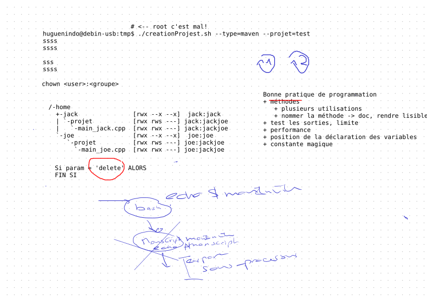

# Leçon 09 - 2026-04-01 (5p)

## Script

* [Activités, série 0006 - Script](https://mylos.s2.rpn.ch/cours/int-sys1-nix/activites/sysnix-activite-0006-script/)
    * [Éléments de solution](elements-de-solution/sysnix-activite-0006-script)
    * commenter le script "Génération d'un projet en java"

## Virtualisation kvm


* [SYSNIX - Virtualisation](https://mylos.s2.rpn.ch/cours/int-sys1-nix/virtualisation/)
   1. accès à la vm
      1. [Virtualisation, Activation de l'accès à la console texte de VM KVM](https://mylos.s2.rpn.ch/cours/int-sys1-nix/fiches/virtualisation-console-virsh/)
      1. [Virtualisation, Accès à la VM avec la console ou le client SSH](https://mylos.s2.rpn.ch/cours/int-sys1-nix/fiches/virtualisation-console-vs-ssh/)   
   1. [Activités, série 0500 - Libvirt + kvm + lvm](https://mylos.s2.rpn.ch/cours/int-sys1-nix/activites/sysnix-activite-0500-libvirt-kvm-lvm/)
      1. KVM - Cloner [éléments de solution](elements-de-solution/sysnix-activite-0510-kvm-clone)
         1. vm1 -> vm1b
      1. KVM - Cloner dans une LV [éléments de solution](elements-de-solution/sysnix-activite-0520-kvm-lvm-clone)
         1. vm1 -> vm3
         1. vm2 -> vm4
      1. [Virtualisation - Post-installation d'une VM](https://mylos.s2.rpn.ch/cours/int-sys1-nix/fiches/virtualisation-post-installation/)
   1. [Activités, série 0500 - Libvirt + kvm + lvm](https://mylos.s2.rpn.ch/cours/int-sys1-nix/activites/sysnix-activite-0500-libvirt-kvm-lvm/)
      1. KVM - Snapshot
      1. KVM - Ajouter un nouveau disque à la VM
      1. Création d’un nouveau volume logique
      1. KVM - Étendre la taille du disque d’une vm utilisant lvm
      1. KVM - Étendre la taille du disque d’une vm contenu dans un volume logique (LV)

## A faire

* terminer les manipulations de [Activités, série 0500 - Libvirt + kvm + lvm](https://mylos.s2.rpn.ch/cours/int-sys1-nix/activites/sysnix-activite-0500-libvirt-kvm-lvm/)
* étudier les éléments solutions proposés.

## Notes

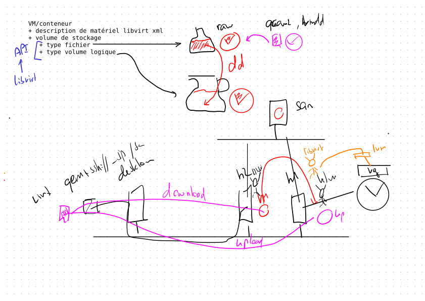

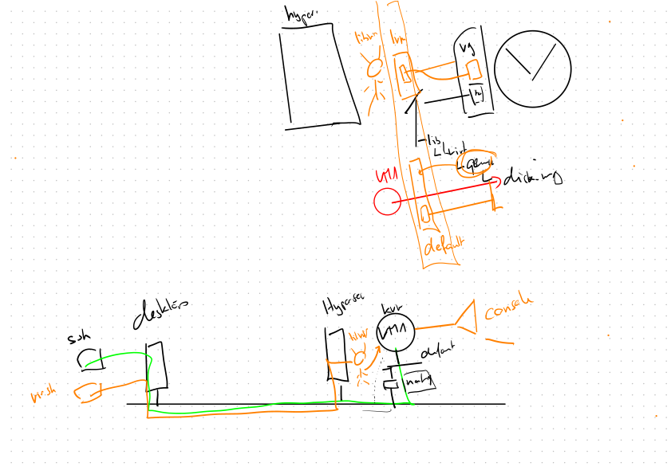


# Leçon 10 - 2026-04-22 (5p)

## Virtualisation kvm (à corriger)

1. [Activités, série 0500 - Libvirt + kvm + lvm](https://mylos.s2.rpn.ch/cours/int-sys1-nix/activites/sysnix-activite-0500-libvirt-kvm-lvm/)
   1. KVM - Étendre la taille du disque d’une vm contenu dans un volume logique (LV) [Éléments de solution](elements-de-solution/sysnix-activite-0530-kvm-extend-disk-v2)
   1. KVM - Étendre la taille du disque d’une vm utilisant lvm (vm4) [Éléments de solution](elements-de-solution/sysnix-activite-0540-kvm-lvm-extend-lv-v2)
   1. KVM - Snapshot (vm3) [Éléments de solution](elements-de-solution/sysnix-activite-0550-kvm-lvm-snapshot)
   1. KVM - Ajouter un nouveau disque à la VM (vm4) [Éléments de solution](elements-de-solution/sysnix-activite-0560-kvm-lvm-add-pv)
   1. Création d’un nouveau volume logique (vm4) [Éléments de solution](elements-de-solution/sysnix-activite-0570-kvm-lvm-add-lv)

## Réseau virtuel

* [SYSNIX - Fiche - Accéder à un serveur distant à travers un tunnel SSH](https://mylos.s2.rpn.ch/cours/int-sys1-nix/fiches/tunnel-ssh/)
* [SYSNIX - Fiche - SSH, authentification sans saisie de mot de passe](https://mylos.s2.rpn.ch/cours/int-sys1-nix/fiches/ssh-authentification-sans-mot-de-passe/)
* [Activités, série 0700 - Mise en réseau des machines virtuelles et accès avec ssh](https://mylos.s2.rpn.ch/cours/int-sys1-nix/activites/sysnix-activite-0700-reseau/)
   * [Éléments de solution](elements-de-solution/sysnix-activite-0700-reseau-v3)
* [Activités, série 0710 - passerelle entre réseaux](https://mylos.s2.rpn.ch/cours/int-sys1-nix/activites/sysnix-activite-0710-reseau-isole/)
   * [Éléments de solution](elements-de-solution/sysnix-activite-0710-reseau-isole-v3)

## A faire

* installer les VM kvmRef1 et kvmRef2

## Notes

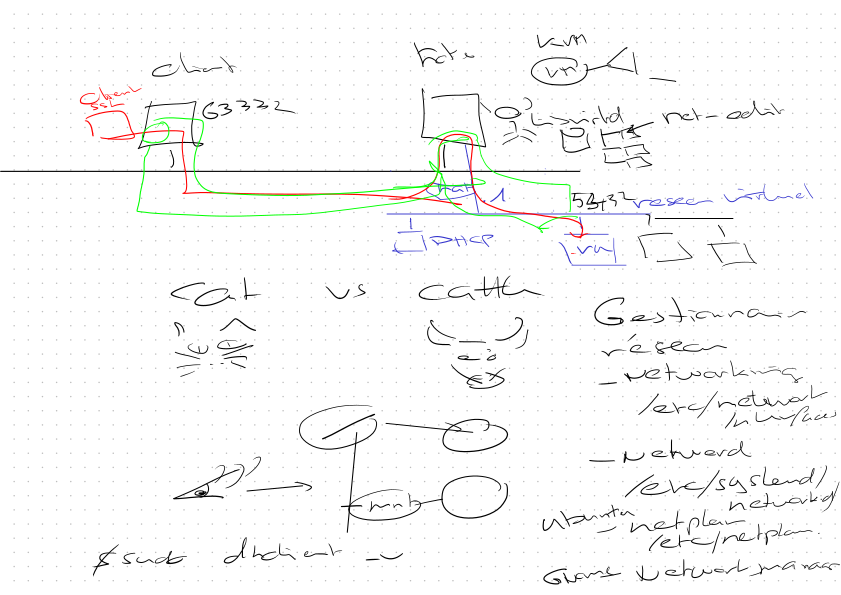

# Leçon 11 - 2026-04-29 (5p)


## Installer les VMs pour l'évaluation

### Installation des VM kvmRef

1. Mettre en place une machine de référence KVM nommée `kvmRef1`.
  1. Copier le fichier `kvmRef1.qcow2` dans le dossier `/var/lib/libvirt/images`
      ```shell
      hote:$ sudo cp ./kvmRef1.qcow2 /var/lib/libvirt/images
      ```
  1. Créer la vm `kvmRef1`
      ```shell
      hote:$ virsh -c qemu:///system define ./kvmRef1.xml
      ```
1. Mettre en place une machine de référence KVM nommée kvmRef2.
  1. Copier le fichier kvmRef2.img dans le dossier /var/lib/libvirt/images
      ```shell
      hote:$ sudo cp ./kvmRef2.img /var/lib/libvirt/images
      ```
  1. Créer la vm `kvmRef2`
      ```shell
      hote:$ virsh -c qemu:///system define ./kvmRef2.xml        
      ```
### Vérifier leurs fonctionnements

```bash
hote:~$ virsh -c qemu:///system                                                                                          
Bienvenue dans virsh, le terminal de virtualisation interactif.
Taper :  « help » pour l’aide des commandes
         « quit » pour quitter

virsh # destroy kvmRef1
Domaine 'kvmRef1' détruit

virsh # destroy kvmRef2
Domaine 'kvmRef2' détruit

virsh # list --all
 ID   Nom         État
-------------------------
 -    kvmRef1     fermé
 -    kvmRef2     fermé

virsh # vol-list default
 Nom             Chemin
--------------------------------------------------------
 kvmRef1.qcow2   /var/lib/libvirt/images/kvmRef1.qcow2
 kvmRef2.img     /var/lib/libvirt/images/kvmRef2.img

virsh # start kvmRef1
Domaine 'kvmRef1' démarré

virsh # start kvmRef2
Domaine 'kvmRef2' démarré

virsh # list --all
 ID   Nom         État
----------------------------------------
 5    kvmRef1     en cours d’exécution
 6    kvmRef2     en cours d’exécution

hote:~$ virsh -c qemu:///system                                                                                          
Bienvenue dans virsh, le terminal de virtualisation interactif.
Taper :  « help » pour l’aide des commandes
         « quit » pour quitter

virsh # domifaddr kvmRef1
 Nom        adresse MAC          Protocole     Adresse
-------------------------------------------------------------------------------
 vnet4      52:54:00:f1:46:99    ipv4         192.168.122.150/24

virsh # console kvmRef1
Connecté au domaine 'kvmRef1'
Le caractère d'échappement est ^] (Ctrl + ])
kvmRef1 login: debian
Mot de passe : 

Linux kvmRef1 6.12.74+deb13+1-amd64 #1 SMP PREEMPT_DYNAMIC Debian 6.12.74-2 (2026-03-08) x86_64
The programs included with the Debian GNU/Linux system are free software;
the exact distribution terms for each program are described in the
individual files in /usr/share/doc/*/copyright.
Debian GNU/Linux comes with ABSOLUTELY NO WARRANTY, to the extent
permitted by applicable law.

debian@kvmRef1:~$

debian@kvmRef1:~$ ip a
1: lo: <LOOPBACK,UP,LOWER_UP> mtu 65536 qdisc noqueue state UNKNOWN group default qlen 1000
    link/loopback 00:00:00:00:00:00 brd 00:00:00:00:00:00
    inet 127.0.0.1/8 scope host lo
       valid_lft forever preferred_lft forever
    inet6 ::1/128 scope host noprefixroute 
       valid_lft forever preferred_lft forever
2: enp1s0: <BROADCAST,MULTICAST,UP,LOWER_UP> mtu 1500 qdisc fq_codel state UP group default qlen 1000
    link/ether 52:54:00:f1:46:99 brd ff:ff:ff:ff:ff:ff
    altname enx525400f14699
    inet 192.168.122.150/24 brd 192.168.122.255 scope global dynamic noprefixroute enp1s0
       valid_lft 3534sec preferred_lft 3084sec
    inet6 fe80::8819:2ffe:7309:640b/64 scope link 
       valid_lft forever preferred_lft forever

debian@kvmRef1:~$ for f in $(ls /etc/ssh/ssh_host_*.pub); do ssh-keygen -lf $f; done;
256 SHA256:ZWE6+aUsX1obh5nTH1rLWhll2rJ/CPXcIpcZZAMGp0Y root@kvmRef1 (ECDSA)
256 SHA256:IsDC9iNtNP+MKYzIe8qXQB/zcKdLa8QNptl8bQD/Rcs root@kvmRef1 (ED25519)
3072 SHA256:rn0M+vtBsxRiW3p2Ry4Wes1Qfam4X3TeWnwQFa8m3p4 root@kvmRef1 (RSA)

debian@kvmRef1:~$ 
debian@kvmRef1:~$ exit
déconnexion

Debian GNU/Linux 13 kvmRef1 ttyS0
kvmRef1 login: 

virsh # exit

hote:~$ ssh -o IdentitiesOnly=yes debian@192.168.122.150
debian@192.168.122.150's password: 

Linux kvmRef1 6.12.74+deb13+1-amd64 #1 SMP PREEMPT_DYNAMIC Debian 6.12.74-2 (2026-03-08) x86_64
The programs included with the Debian GNU/Linux system are free software;
the exact distribution terms for each program are described in the
individual files in /usr/share/doc/*/copyright.
Debian GNU/Linux comes with ABSOLUTELY NO WARRANTY, to the extent
permitted by applicable law.
Last login: Mon Mar 30 16:07:19 2026 from 192.168.122.1

debian@kvmRef1:~$ exit
déconnexion

Connection to 192.168.122.150 closed.

hote:~$ virsh -c qemu:///system
Bienvenue dans virsh, le terminal de virtualisation interactif.
Taper :  « help » pour l’aide des commandes
         « quit » pour quitter

virsh # domifaddr kvmRef2
 Nom        adresse MAC          Protocole     Adresse
-------------------------------------------------------------------------------
 vnet5      52:54:00:47:21:40    ipv4         192.168.122.206/24
 -          -                    ipv4         192.168.122.207/24

virsh # console kvmRef2
Connecté au domaine 'kvmRef2'
Le caractère d'échappement est ^] (Ctrl + ])
kvmRef2 login: debian
Mot de passe : 

Linux kvmRef2 6.12.74+deb13+1-amd64 #1 SMP PREEMPT_DYNAMIC Debian 6.12.74-2 (2026-03-08) x86_64
The programs included with the Debian GNU/Linux system are free software;
the exact distribution terms for each program are described in the
individual files in /usr/share/doc/*/copyright.
Debian GNU/Linux comes with ABSOLUTELY NO WARRANTY, to the extent
permitted by applicable law.

debian@kvmRef2:~$ ip a
1: lo: <LOOPBACK,UP,LOWER_UP> mtu 65536 qdisc noqueue state UNKNOWN group default qlen 1000
    link/loopback 00:00:00:00:00:00 brd 00:00:00:00:00:00
    inet 127.0.0.1/8 scope host lo
       valid_lft forever preferred_lft forever
    inet6 ::1/128 scope host noprefixroute 
       valid_lft forever preferred_lft forever
2: enp1s0: <BROADCAST,MULTICAST,UP,LOWER_UP> mtu 1500 qdisc fq_codel state UP group default qlen 1000
    link/ether 52:54:00:47:21:40 brd ff:ff:ff:ff:ff:ff
    altname enx525400472140
    inet 192.168.122.207/24 brd 192.168.122.255 scope global dynamic noprefixroute enp1s0
       valid_lft 3276sec preferred_lft 2644sec
    inet6 fe80::2467:9613:4d3d:c829/64 scope link 
       valid_lft forever preferred_lft forever
       
debian@kvmRef2:~$ for f in $(ls /etc/ssh/ssh_host_*.pub); do ssh-keygen -lf $f; done;
256 SHA256:489zjWSu0lXHGDw7vCg0Vw/THlA4yfdsdsaHQl6eCk8 root@kvmRef2 (ECDSA)
256 SHA256:ZbrOceXdD5dqYmAlkw0LKWLWYwRFZQ3BCuClim0Mb+k root@kvmRef2 (ED25519)
3072 SHA256:7v0OjFLXTMCpjpiyyRVZD/qDZI9/EiKKJOSIaNORaBc root@kvmRef2 (RSA)

debian@kvmRef2:~$ exit
déconnexion

Debian GNU/Linux 13 kvmRef2 ttyS0
kvmRef2 login: 

virsh # exit

hote:~$ ssh -o IdentitiesOnly=yes debian@192.168.122.207
The authenticity of host '192.168.122.207 (192.168.122.207)' can't be established.
ED25519 key fingerprint is SHA256:ZbrOceXdD5dqYmAlkw0LKWLWYwRFZQ3BCuClim0Mb+k.
This key is not known by any other names.
Are you sure you want to continue connecting (yes/no/[fingerprint])? yes
Warning: Permanently added '192.168.122.207' (ED25519) to the list of known hosts.

debian@192.168.122.207's password: 

Linux kvmRef2 6.12.74+deb13+1-amd64 #1 SMP PREEMPT_DYNAMIC Debian 6.12.74-2 (2026-03-08) x86_64
The programs included with the Debian GNU/Linux system are free software;
the exact distribution terms for each program are described in the
individual files in /usr/share/doc/*/copyright.
Debian GNU/Linux comes with ABSOLUTELY NO WARRANTY, to the extent
permitted by applicable law.

debian@kvmRef2:~$ exit
déconnexion

Connection to 192.168.122.207 closed.
```


## installation et configuration Incus

* installer et configurer incus fork de lxd [Virtualisation - incus + zfs](https://mylos.s2.rpn.ch/cours/int-sys1-nix/fiches/virtualisation-incus-zfs/index.html)
* [Virtualisation - machine virtuelle versus conteneur](https://mylos.s2.rpn.ch/cours/int-sys1-nix/fiches/virtualisation-vm-conteneur/) - impact sur les ressources 
* [Installation de la base de données PostgreSQL](https://mylos.s2.rpn.ch/cours/int-prog1-db/infrastructure/installation-postgresql/) dans un conteneur incus
   1. configuration du schéma magasin [intbasdb.schema-magasin](https://mylos.s2.rpn.ch/gitlab/dhu.cours/intbasdb/activites/intbasdb.schema-magasin)
   1. Configuration du schéma recette [intbasdb.100-modelisation-recette](https://mylos.s2.rpn.ch/gitlab/dhu.cours/intbasdb/activites/intbasdb.100-modelisation-recette)

### Accès via ssh sur un conteneur

```
huguenindo@debian-usb:~$ incus launch images:debian/bookworm/cloud test

huguenindo@debian-usb:~$ incus list
+---------+---------+-------------------------+------+-----------------+-------------+
|   NOM   |  ÉTAT   |          IPV4           | IPV6 |      TYPE       | INSTANTANÉS |
+---------+---------+-------------------------+------+-----------------+-------------+
| netboot | STOPPED |                         |      | VIRTUAL-MACHINE | 0           |
+---------+---------+-------------------------+------+-----------------+-------------+
| test    | RUNNING | 10.246.230.156 (eth0)   |      | CONTAINER       | 0           |
+---------+---------+-------------------------+------+-----------------+-------------+

huguenindo@debian-usb:~$ ls ~/.ssh/
authorized_keys  huguenindo@kobenhavn_rsa      huguenindo@lozan_rsa      id_rsa      known_hosts      kobenhavn_id_rsa      other_keys.seahorse
config           huguenindo@kobenhavn_rsa.pub  huguenindo@lozan_rsa.pub  id_rsa.pub  known_hosts.old  kobenhavn_id_rsa.pub

huguenindo@debian-usb:~$ cat ~/.ssh/id_rsa.pub 
ssh-rsa AAAAB3NzaC1yc2EAAAADAQABAAABgQC3fJWK08d4ciGf/1tbrefIEDZXlqtJrtiCstFXjwodxFimVpjz/mSu7TrqGKDDu0vcZ7Ph4K70i/tjcYaJACEk/Vtb8cUm1KejsHdKue0bBGPZQAqyQc35hmDALRqYXYRsgf3NacGaUKg3O1FlOPPJZrZ+h50H7swJF7HN3obWR7R3AuReSWxsenKNHNB31LidJN07Rix0BNrFf6Hk8EIDfx2DIDgIIs5t0DgGgIG5GZkkUA/kf6+WIx6Gs2VQAy8mjW5HahJaoAcBtAy9j/nrtPpgQA+amoEEn01+h8P0xkYJyiwpriFps9Z0C3Y8xMbzBu/LFKGlRsdmAZOom8mLEicOOwiD3qebdS5UTYp1ErGSLTcQpOjVEGhGFPM2UYPD6+qCmnsosFEZMQQDZ+Icaip2QV8I3zJ17DiXuWQ+F8vj85sZLPx4st/ri2Xhrfm7jRi0NtYf9+Xe1FPZyUbkIiqpzSffhAYK4giMdb/Rnh6mD1YBab5sYpsoHdYvfaM= huguenindo@ubuntu-usb-dhu

huguenindo@debian-usb:~$ incus shell test
root@test:~# su -l debian
debian@test:~$ echo 'ssh-rsa AAAAB3NzaC1yc2EAAAADAQABAAABgQC3fJWK08d4ciGf/1tbrefIEDZXlqtJrtiCstFXjwodxFimVpjz/mSu7TrqGKDDu0vcZ7Ph4K70i/tjcYaJACEk/Vtb8cUm1KejsHdKue0bBGPZQAqyQc35hmDALRqYXYRsgf3NacGaUKg3O1FlOPPJZrZ+h50H7swJF7HN3obWR7R3AuReSWxsenKNHNB31LidJN07Rix0BNrFf6Hk8EIDfx2DIDgIIs5t0DgGgIG5GZkkUA/kf6+WIx6Gs2VQAy8mjW5HahJaoAcBtAy9j/nrtPpgQA+amoEEn01+h8P0xkYJyiwpriFps9Z0C3Y8xMbzBu/LFKGlRsdmAZOom8mLEicOOwiD3qebdS5UTYp1ErGSLTcQpOjVEGhGFPM2UYPD6+qCmnsosFEZMQQDZ+Icaip2QV8I3zJ17DiXuWQ+F8vj85sZLPx4st/ri2Xhrfm7jRi0NtYf9+Xe1FPZyUbkIiqpzSffhAYK4giMdb/Rnh6mD1YBab5sYpsoHdYvfaM= huguenindo@ubuntu-usb-dhu' >> ~/.ssh/authorized_keys 

root@test:~# apt install openssh-server
Reading package lists... Done
Building dependency tree... Done
Reading state information... Done
The following additional packages will be installed:
  libwrap0 ncurses-term openssh-sftp-server runit-helper ucf
Suggested packages:
  molly-guard monkeysphere ssh-askpass ufw
The following NEW packages will be installed:
  libwrap0 ncurses-term openssh-server openssh-sftp-server runit-helper ucf
0 upgraded, 6 newly installed, 0 to remove and 0 not upgraded.
Need to get 1,140 kB of archives.
After this operation, 6,942 kB of additional disk space will be used.
Do you want to continue? [Y/n] y
...
root@test:~# exit
logout

huguenindo@debian-usb:~$ ssh debian@10.246.230.156
The authenticity of host '10.246.230.156 (10.246.230.156)' can't be established.
ED25519 key fingerprint is SHA256:iRbev6oNGgWTaqwk+xw0cwOH/NAXL9NzLtluvXoctDE.
This key is not known by any other names.
Are you sure you want to continue connecting (yes/no/[fingerprint])? yes
Warning: Permanently added '10.246.230.156' (ED25519) to the list of known hosts.
Linux test 6.1.0-34-amd64 #1 SMP PREEMPT_DYNAMIC Debian 6.1.135-1 (2025-04-25) x86_64

The programs included with the Debian GNU/Linux system are free software;
the exact distribution terms for each program are described in the
individual files in /usr/share/doc/*/copyright.

Debian GNU/Linux comes with ABSOLUTELY NO WARRANTY, to the extent
permitted by applicable law.
debian@test:~$ 
```

### Affichage des vm 

```
huguenindo@debian-usb:~$ incus list
+---------+---------+-------------------------+------+-----------------+-------------+
|   NOM   |  ÉTAT   |          IPV4           | IPV6 |      TYPE       | INSTANTANÉS |
+---------+---------+-------------------------+------+-----------------+-------------+
| netboot | STOPPED |                         |      | VIRTUAL-MACHINE | 0           |
+---------+---------+-------------------------+------+-----------------+-------------+
| test    | RUNNING | 10.246.230.156 (eth0)   |      | CONTAINER       | 0           |
+---------+---------+-------------------------+------+-----------------+-------------+
| vm1     | RUNNING | 10.246.230.209 (enp5s0) |      | VIRTUAL-MACHINE | 0           |
+---------+---------+-------------------------+------+-----------------+-------------+
huguenindo@debian-usb:~$ incus list --project dev
+-----+---------+--------------------+-----------------------------------------------+-----------+-------------+
| NOM |  ÉTAT   |        IPV4        |                     IPV6                      |   TYPE    | INSTANTANÉS |
+-----+---------+--------------------+-----------------------------------------------+-----------+-------------+
| db  | RUNNING | 172.16.3.23 (eth0) | fd42:81fc:4834:eaa8:216:3eff:fe1e:1e63 (eth0) | CONTAINER | 0           |
+-----+---------+--------------------+-----------------------------------------------+-----------+-------------+
huguenindo@debian-usb:~$ incus list --all-projects
+---------+---------+---------+-------------------------+-----------------------------------------------+-----------------+-------------+
| PROJECT |   NOM   |  ÉTAT   |          IPV4           |                     IPV6                      |      TYPE       | INSTANTANÉS |
+---------+---------+---------+-------------------------+-----------------------------------------------+-----------------+-------------+
| default | netboot | STOPPED |                         |                                               | VIRTUAL-MACHINE | 0           |
+---------+---------+---------+-------------------------+-----------------------------------------------+-----------------+-------------+
| default | test    | RUNNING | 10.246.230.156 (eth0)   |                                               | CONTAINER       | 0           |
+---------+---------+---------+-------------------------+-----------------------------------------------+-----------------+-------------+
| default | vm1     | RUNNING | 10.246.230.209 (enp5s0) |                                               | VIRTUAL-MACHINE | 0           |
+---------+---------+---------+-------------------------+-----------------------------------------------+-----------------+-------------+
| dev     | db      | RUNNING | 172.16.3.23 (eth0)      | fd42:81fc:4834:eaa8:216:3eff:fe1e:1e63 (eth0) | CONTAINER       | 0           |
+---------+---------+---------+-------------------------+-----------------------------------------------+-----------------+-------------+
| intdb   | intdb   | RUNNING | 10.246.230.223 (eth0)   |                                               | CONTAINER       | 0           |
+---------+---------+---------+-------------------------+-----------------------------------------------+-----------------+-------------+
```

### Installation du l'interface web

```
huguenindo@debian-usb:~$ sudo apt install incus-ui-canonical
[sudo] Mot de passe de huguenindo : 
Lecture des listes de paquets... Fait
Construction de l'arbre des dépendances... Fait
Lecture des informations d'état... Fait      
Les paquets suivants ont été installés automatiquement et ne sont plus nécessaires :
  linux-headers-6.1.0-28-amd64 linux-headers-6.1.0-28-common linux-headers-6.1.0-30-amd64 linux-headers-6.1.0-30-common
  linux-headers-6.1.0-31-amd64 linux-headers-6.1.0-31-common linux-image-6.1.0-28-amd64 linux-image-6.1.0-30-amd64 linux-image-6.1.0-31-amd64
Veuillez utiliser « sudo apt autoremove » pour les supprimer.
Les NOUVEAUX paquets suivants seront installés :
  incus-ui-canonical
0 mis à jour, 1 nouvellement installés, 0 à enlever et 0 non mis à jour.
Il est nécessaire de prendre 3’597 ko dans les archives.
Après cette opération, 20.2 Mo d'espace disque supplémentaires seront utilisés.
Réception de :1 https://pkgs.zabbly.com/incus/stable bookworm/main amd64 incus-ui-canonical amd64 1:6.12-debian12-202504242211 [3’597 kB]
3’597 ko réceptionnés en 2s (2’239 ko/s)         
Sélection du paquet incus-ui-canonical précédemment désélectionné.
(Lecture de la base de données... 498080 fichiers et répertoires déjà installés.)
Préparation du dépaquetage de .../incus-ui-canonical_1%3a6.12-debian12-202504242211_amd64.deb ...
Dépaquetage de incus-ui-canonical (1:6.12-debian12-202504242211) ...
Paramétrage de incus-ui-canonical (1:6.12-debian12-202504242211) ...

huguenindo@debian-usb:~$ incus webui
Web server running at: http://127.0.0.1:33887/ui?auth_token=40fefe3f-3c9e-444a-a3a3-6c698a1e5603
^C

```


## Notes


# Leçon 12 - 2026-05-06 (5p)  (évaluation)
> Évaluation shell + virtualisation

# Leçon 13 - 2026-05-13 (5p)


> correction de l'évaluation
> Service réseau dhcp - dns

## Service réseau

* [Services réseaux](https://mylos.s2.rpn.ch/cours/int-sys1-nix/services-reseaux/)
   * [Service réseau - Cas d'études](https://mylos.s2.rpn.ch/cours/int-sys1-nix/services-reseaux/cas-etude/)
   * [Service réseau - Mise en place de l'infrastructure de virtualisation](https://mylos.s2.rpn.ch/cours/int-sys1-nix/services-reseaux/infrastructure-virtualisation/)
      1. Création d'un projet `antiterre`
      1. Création du réseau virtuelle `antbr0` en `192.168.100.0/24` sans DHCP
      1. Création du profil antiterre utilisant par défaut le réseau `antbr0`
      1. Création du conteneur `blossfeldtstad`

## DHCP

* [Services réseaux](https://mylos.s2.rpn.ch/cours/int-sys1-nix/services-reseaux/)
    1. installer le service DHCP - [Service réseau - Service DHCP, Dynamic Host Configuration Protocol](https://mylos.s2.rpn.ch/cours/int-sys1-nix/services-reseaux/srv-dhcp/)

* verification des log

  ```bash
  root@blossfeldtstad:~# journalctl -u isc-dhcp-server
  ```
  q
* Vérification de la configuration

    ```bash
    debian@blossfeldtstad:~$ dhcpd -t -cf /etc/dhcp/dhcpd.conf
    ```

* Demander une adresse au DHCP

  ```bash
  huguenindo@mc0-0315-00:~$ sudo dhclient -v
  ```


## Services réseaux - DNS

* [Service réseau - Mise en réseau](https://mylos.s2.rpn.ch/cours/int-sys1-nix/services-reseaux/mise-en-reseau/)
    1. [Service réseau - Service DNS, Domaine Name System](https://mylos.s2.rpn.ch/cours/int-sys1-nix/services-reseaux/srv-dns/)

## A faire

1. finir l'installation du DHCP, DNS sur blossfeldtstad
1. Créer les machines galatograd (conteneur), urbicande (VM), cavi (VM), luna (VM)
   * C'est le dhcp qui distribue les adresses ip static à galatograd et urbicande

## Notes

### Création d'un projet
```shel
huguenindo@debian-usb:~$ incus project create test
Project test created
huguenindo@debian-usb:~$ incus project list
+---------------------+--------+---------+-----------------+-----------------+----------+---------------+-----------------------------------------------------------------+-------------+
|         NOM         | IMAGES | PROFILS | STORAGE VOLUMES | STORAGE BUCKETS | NETWORKS | NETWORK ZONES |                           DESCRIPTION                           | UTILISÉ PAR |
+---------------------+--------+---------+-----------------+-----------------+----------+---------------+-----------------------------------------------------------------+-------------+
| test                | OUI    | OUI     | OUI             | OUI             | NON      | NON           |                                                                 | 1           |
+---------------------+--------+---------+-----------------+-----------------+----------+---------------+-----------------------------------------------------------------+-------------+
huguenindo@debian-usb:~$ incus project create test2 -c features.images=false
Project test2 created
huguenindo@debian-usb:~$ incus project list
+---------------------+--------+---------+-----------------+-----------------+----------+---------------+-----------------------------------------------------------------+-------------+
|         NOM         | IMAGES | PROFILS | STORAGE VOLUMES | STORAGE BUCKETS | NETWORKS | NETWORK ZONES |                           DESCRIPTION                           | UTILISÉ PAR |
+---------------------+--------+---------+-----------------+-----------------+----------+---------------+-----------------------------------------------------------------+-------------+
| test                | OUI    | OUI     | OUI             | OUI             | NON      | NON           |                                                                 | 1           |
+---------------------+--------+---------+-----------------+-----------------+----------+---------------+-----------------------------------------------------------------+-------------+
| test2               | NON    | OUI     | OUI             | OUI             | NON      | NON           |                                                                 | 1           |
+---------------------+--------+---------+-----------------+-----------------+----------+---------------+-----------------------------------------------------------------+-------------+

huguenindo@debian-usb:~$ incus project switch test2
huguenindo@debian-usb:~$ incus project list
+-----------------+--------+---------+-----------------+-----------------+----------+---------------+-----------------------------------------------------------------+-------------+
|       NOM       | IMAGES | PROFILS | STORAGE VOLUMES | STORAGE BUCKETS | NETWORKS | NETWORK ZONES |                           DESCRIPTION                           | UTILISÉ PAR |
+-----------------+--------+---------+-----------------+-----------------+----------+---------------+-----------------------------------------------------------------+-------------+
| test            | OUI    | OUI     | OUI             | OUI             | NON      | NON           |                                                                 | 1           |
+-----------------+--------+---------+-----------------+-----------------+----------+---------------+-----------------------------------------------------------------+-------------+
| test2 (current) | NON    | OUI     | OUI             | OUI             | NON      | NON           |                                                                 | 1           |
+-----------------+--------+---------+-----------------+-----------------+----------+---------------+-----------------------------------------------------------------+-------------+
huguenindo@debian-usb:~$ 

```

# Leçon 14 - 2026-05-20 (5p)


## Configuration du DNS d'antiterre sur la machine hôte

```shell
huguenindo@debian-usb:antiterre.infra$ sudo resolvectl dns antbr0 192.168.100.10
huguenindo@debian-usb:antiterre.infra$ sudo resolvectl domain antbr0 '~antiterre.lan'

huguenindo@debian-usb:antiterre.infra$ sudo resolvectl status --no-pager
Global
       Protocols: +LLMNR +mDNS -DNSOverTLS DNSSEC=no/unsupported
resolv.conf mode: stub

Link 2 (eno1)
    Current Scopes: DNS LLMNR/IPv4 LLMNR/IPv6
         Protocols: +DefaultRoute +LLMNR -mDNS -DNSOverTLS DNSSEC=no/unsupported
Current DNS Server: 157.26.166.16
       DNS Servers: 157.26.166.16 157.26.166.17
        DNS Domain: s2.rpn.ch

...

Link 6 (antbr0)
    Current Scopes: DNS LLMNR/IPv4
         Protocols: -DefaultRoute +LLMNR -mDNS -DNSOverTLS DNSSEC=no/unsupported
Current DNS Server: 192.168.100.10
       DNS Servers: 192.168.100.10
        DNS Domain: ~antiterre.lan

...

huguenindo@debian-usb:antiterre.infra$ ssh robick@cavi.antiterre.lan
The authenticity of host 'cavi.antiterre.lan (192.168.100.176)' can't be established.
ED25519 key fingerprint is SHA256:mdeELEFgyXlR2zvAqGypYsCd82Qa0IFSEfuEgtju9yo.
This key is not known by any other names.
Are you sure you want to continue connecting (yes/no/[fingerprint])? yes
Warning: Permanently added 'cavi.antiterre.lan' (ED25519) to the list of known hosts.
robick@cavi.antiterre.lan's password: 
Linux cavi 6.1.0-34-amd64 #1 SMP PREEMPT_DYNAMIC Debian 6.1.135-1 (2025-04-25) x86_64

The programs included with the Debian GNU/Linux system are free software;
the exact distribution terms for each program are described in the
individual files in /usr/share/doc/*/copyright.

Debian GNU/Linux comes with ABSOLUTELY NO WARRANTY, to the extent
permitted by applicable law.
robick@cavi:~$ exit
logout
Connection to cavi.antiterre.lan closed.

huguenindo@debian-usb:antiterre.infra$ dig cavi.antiterre.lan

; <<>> DiG 9.18.33-1~deb12u2-Debian <<>> cavi.antiterre.lan
;; global options: +cmd
;; Got answer:
;; ->>HEADER<<- opcode: QUERY, status: NOERROR, id: 62335
;; flags: qr rd ra; QUERY: 1, ANSWER: 1, AUTHORITY: 0, ADDITIONAL: 1

;; OPT PSEUDOSECTION:
; EDNS: version: 0, flags:; udp: 65494
;; QUESTION SECTION:
;cavi.antiterre.lan.		IN	A

;; ANSWER SECTION:
cavi.antiterre.lan.	110	IN	A	192.168.100.176

;; Query time: 0 msec
;; SERVER: 127.0.0.53#53(127.0.0.53) (UDP)
;; WHEN: Tue May 13 12:06:56 CEST 2025
;; MSG SIZE  rcvd: 63

huguenindo@debian-usb:antiterre.infra$ dig blossfeldtstad.antiterre.lan

; <<>> DiG 9.18.33-1~deb12u2-Debian <<>> blossfeldtstad.antiterre.lan
;; global options: +cmd
;; Got answer:
;; ->>HEADER<<- opcode: QUERY, status: NOERROR, id: 7080
;; flags: qr rd ra; QUERY: 1, ANSWER: 2, AUTHORITY: 0, ADDITIONAL: 1

;; OPT PSEUDOSECTION:
; EDNS: version: 0, flags:; udp: 65494
;; QUESTION SECTION:
;blossfeldtstad.antiterre.lan.	IN	A

;; ANSWER SECTION:
blossfeldtstad.antiterre.lan. 604800 IN	CNAME	ns1.antiterre.lan.
ns1.antiterre.lan.	604800	IN	A	192.168.100.10

;; Query time: 4 msec
;; SERVER: 127.0.0.53#53(127.0.0.53) (UDP)
;; WHEN: Tue May 13 12:07:12 CEST 2025
;; MSG SIZE  rcvd: 91

```
> le paquet systemd-resolved doit être installé!

## Services réseaux - AS, kerberos

* [Les principes du chiffrement](https://mylos.s2.rpn.ch/cours/int-sys2-iweb/https/chiffrement-principe/index.html)
* [Services réseaux](https://mylos.s2.rpn.ch/cours/int-sys1-nix/services-reseaux/)
   * [Service réseau - Service d'authentification](https://mylos.s2.rpn.ch/cours/int-sys1-nix/services-reseaux/authentification/)
      1. [Service réseau - Service d'authentification Kerberos](https://mylos.s2.rpn.ch/cours/int-sys1-nix/services-reseaux/srv-kerberos/)
         * montrer avec wireshark les échanges entre le client et le serveur kerberos lors de l'authentification. (kinit)

## Services réseaux - AS, LDAP

* [Services réseaux](https://mylos.s2.rpn.ch/cours/int-sys1-nix/services-reseaux/)
    * [Service réseau - Service d'authentification](https://mylos.s2.rpn.ch/cours/int-sys1-nix/services-reseaux/authentification/)
        1. [Service réseau - Service d'annuaire LDAP](https://mylos.s2.rpn.ch/cours/int-sys1-nix/services-reseaux/srv-ldap/)


## A faire

1. finaliser l'installation de [Service réseau - Service d'authentification Kerberos](https://mylos.s2.rpn.ch/cours/int-sys1-nix/services-reseaux/srv-kerberos/)
    * montrer avec wireshark les échanges entre le client et le serveur kerberos lors de l'authentification. (kinit)
1. [Service réseau - Service d'annuaire LDAP](https://mylos.s2.rpn.ch/cours/int-sys1-nix/services-reseaux/srv-ldap/)
   * installer le service ldap
   * créer l'utilisateur robick

## Notes

### Vérification de la configuration du DNS sur cavisudo vipw
```shell
huguenindo@debian-usb:antiterre.infra$ incus shell cavi
root@cavi:~# su -l admin
admin@cavi:~$ resolvectl status --no-pager
Global
       Protocols: +LLMNR +mDNS -DNSOverTLS DNSSEC=no/unsupported
resolv.conf mode: stub

Link 2 (enp5s0)
    Current Scopes: DNS LLMNR/IPv4 LLMNR/IPv6
         Protocols: +DefaultRoute +LLMNR -mDNS -DNSOverTLS DNSSEC=no/unsupported
Current DNS Server: 192.168.100.11
       DNS Servers: 192.168.100.11 192.168.100.10
admin@cavi:~$ dig blossfeldtstad.antiterre.lan

; <<>> DiG 9.18.33-1~deb12u2-Debian <<>> blossfeldtstad.antiterre.lan
;; global options: +cmd
;; Got answer:
;; ->>HEADER<<- opcode: QUERY, status: NOERROR, id: 27468
;; flags: qr rd ra; QUERY: 1, ANSWER: 2, AUTHORITY: 0, ADDITIONAL: 1

;; OPT PSEUDOSECTION:
; EDNS: version: 0, flags:; udp: 65494
;; QUESTION SECTION:
;blossfeldtstad.antiterre.lan.	IN	A

;; ANSWER SECTION:
blossfeldtstad.antiterre.lan. 604800 IN	CNAME	ns1.antiterre.lan.
ns1.antiterre.lan.	604800	IN	A	192.168.100.10

;; Query time: 0 msec
;; SERVER: 127.0.0.53#53(127.0.0.53) (UDP)
;; WHEN: Wed May 21 06:30:06 UTC 2025
;; MSG SIZE  rcvd: 91

admin@cavi:~$ dig blossfeldtstad.antiterre.lan @192.168.100.10

; <<>> DiG 9.18.33-1~deb12u2-Debian <<>> blossfeldtstad.antiterre.lan @192.168.100.10
;; global options: +cmd
;; Got answer:
;; ->>HEADER<<- opcode: QUERY, status: NOERROR, id: 32658
;; flags: qr aa rd ra; QUERY: 1, ANSWER: 2, AUTHORITY: 0, ADDITIONAL: 1

;; OPT PSEUDOSECTION:
; EDNS: version: 0, flags:; udp: 1232
; COOKIE: 78453df0a0eff11501000000682d7303af66132f64213c7f (good)
;; QUESTION SECTION:
;blossfeldtstad.antiterre.lan.	IN	A

;; ANSWER SECTION:
blossfeldtstad.antiterre.lan. 604800 IN	CNAME	ns1.antiterre.lan.
ns1.antiterre.lan.	604800	IN	A	192.168.100.10

;; Query time: 0 msec
;; SERVER: 192.168.100.10#53(192.168.100.10) (UDP)
;; WHEN: Wed May 21 06:30:26 UTC 2025
;; MSG SIZE  rcvd: 119
```

### Suppression du mot de passe d'un utilisateur local

* editer le fichier /etch/shadow
   ```shell
   admin@cavi:~$ sudo vipw -s
   ```
* Remplacer le mot de passe par le caractère `!`


# Leçon 15 - 2026-05-27 (5p)

## Services réseaux - AS, LDAP

* [Services réseaux](https://mylos.s2.rpn.ch/cours/int-sys1-nix/services-reseaux/)
    * [Service réseau - Service d'authentification](https://mylos.s2.rpn.ch/cours/int-sys1-nix/services-reseaux/authentification/)
        1. [Utilitaires LDAP](https://mylos.s2.rpn.ch/cours/int-sys1-nix/services-reseaux/srv-ldap/#utilitaires-ldap)
        1. [Activité, Requêtes LDAP](https://mylos.s2.rpn.ch/cours/int-sys1-nix/activites/services-reseaux-activite-1300-ldap-requetes/)
            * [Éléments de solution](./elements-de-solution/services-reseaux-activite-1300-ldap-requetes)
            * chaîne de connexion sur ldap.s2.rpn.ch
                ```bash
                huguenindo@ubuntu-usb-dhu:~$ ldapsearch -H ldap://ldap.s2.rpn.ch\
                            -D "CN=Huguenin Dominique (DHU),OU=Enseignants,OU=TI,OU=CPNE,OU=Utilisateurs,DC=s2,DC=rpn,DC=ch"\
                            -W\
                            -b OU=CPNE,OU=Utilisateurs,DC=s2,DC=rpn,DC=ch\
                            "(cn=*Huguenin*)"\
                            dn
                Enter LDAP Password: 
                # extended LDIF
                #
                # LDAPv3
                # base <OU=CPNE,OU=Utilisateurs,DC=s2,DC=rpn,DC=ch> with scope subtree
                # filter: (cn=*Huguenin*)
                # requesting: dn 
                #

                # Huguenin-Elie Nathan, 2DIN-C-DMa, DIN-C-D, Eleves, AS, CPNE, Utilisateurs, s2
                .rpn.ch
                dn: CN=Huguenin-Elie Nathan,OU=2DIN-C-DMa,OU=DIN-C-D,OU=Eleves,OU=AS,OU=CPNE,O
                U=Utilisateurs,DC=s2,DC=rpn,DC=ch

                # Huguenin-Dumittan Timoth\C3\A9e, 4MMA-C-DKa, MMA-CD, Eleves, TI, CPNE, Utilis
                ateurs, s2.rpn.ch
                dn:: Q049SHVndWVuaW4tRHVtaXR0YW4gVGltb3Row6llLE9VPTRNTUEtQy1ES2EsT1U9TU1BLUNEL
                E9VPUVsZXZlcyxPVT1USSxPVT1DUE5FLE9VPVV0aWxpc2F0ZXVycyxEQz1zMixEQz1ycG4sREM9Y2
                g=

                # Huguenin-Virchaux Ma\C3\ABl, 4HOR-C-PKa, HOR-CP, Eleves, TI, CPNE, Utilisateu
                rs, s2.rpn.ch
                dn:: Q049SHVndWVuaW4tVmlyY2hhdXggTWHDq2wsT1U9NEhPUi1DLVBLYSxPVT1IT1ItQ1AsT1U9R
                WxldmVzLE9VPVRJLE9VPUNQTkUsT1U9VXRpbGlzYXRldXJzLERDPXMyLERDPXJwbixEQz1jaA==

                # Huguenin-Dumittan Lo\C3\AFc, 4PME-4TDKa, PME-4TD, Eleves, TI, CPNE, Utilisate
                urs, s2.rpn.ch
                dn:: Q049SHVndWVuaW4tRHVtaXR0YW4gTG/Dr2MsT1U9NFBNRS00VERLYSxPVT1QTUUtNFRELE9VP
                UVsZXZlcyxPVT1USSxPVT1DUE5FLE9VPVV0aWxpc2F0ZXVycyxEQz1zMixEQz1ycG4sREM9Y2g=

                # Huguenin-Elie Ethan, 2MML-C-DKa, MML-CD, Eleves, TI, CPNE, Utilisateurs, s2.r
                pn.ch
                dn: CN=Huguenin-Elie Ethan,OU=2MML-C-DKa,OU=MML-CD,OU=Eleves,OU=TI,OU=CPNE,OU=
                Utilisateurs,DC=s2,DC=rpn,DC=ch

                # Huguenin Dominique - El\C3\A8ve, Eleves, TI, CPNE, Utilisateurs, s2.rpn.ch
                dn:: Q049SHVndWVuaW4gRG9taW5pcXVlIC0gRWzDqHZlLE9VPUVsZXZlcyxPVT1USSxPVT1DUE5FL
                E9VPVV0aWxpc2F0ZXVycyxEQz1zMixEQz1ycG4sREM9Y2g=

                # Huguenin Brayan, 3PRO-S-EMa, PRO-SE, Eleves, TI, CPNE, Utilisateurs, s2.rpn.c
                h
                dn: CN=Huguenin Brayan,OU=3PRO-S-EMa,OU=PRO-SE,OU=Eleves,OU=TI,OU=CPNE,OU=Util
                isateurs,DC=s2,DC=rpn,DC=ch

                # HugueninBGr, 4CAP-C-DKa, CAP-CD, Eleves, TI, CPNE, Utilisateurs, s2.rpn.ch
                dn: CN=HugueninBGr,OU=4CAP-C-DKa,OU=CAP-CD,OU=Eleves,OU=TI,OU=CPNE,OU=Utilisat
                eurs,DC=s2,DC=rpn,DC=ch

                # Huguenin-Virchaux Nicolas (NIH), Enseignants, TI, CPNE, Utilisateurs, s2.rpn.
                ch
                dn: CN=Huguenin-Virchaux Nicolas (NIH),OU=Enseignants,OU=TI,OU=CPNE,OU=Utilisa
                teurs,DC=s2,DC=rpn,DC=ch

                # Huguenin-Vuillemin Philippe (PHG), Enseignants, TI, CPNE, Utilisateurs, s2.rp
                n.ch
                dn: CN=Huguenin-Vuillemin Philippe (PHG),OU=Enseignants,OU=TI,OU=CPNE,OU=Utili
                sateurs,DC=s2,DC=rpn,DC=ch

                # Huguenin Dominique (DHU), Enseignants, TI, CPNE, Utilisateurs, s2.rpn.ch
                dn: CN=Huguenin Dominique (DHU),OU=Enseignants,OU=TI,OU=CPNE,OU=Utilisateurs,D
                C=s2,DC=rpn,DC=ch

                # Huguenin Damien, Eleves, CMOD, CPNE, Utilisateurs, s2.rpn.ch
                dn: CN=Huguenin Damien,OU=Eleves,OU=CMOD,OU=CPNE,OU=Utilisateurs,DC=s2,DC=rpn,
                DC=ch

                # Huguenin-Dumittan Amalia (AHD), Enseignants, 2S, CPNE, Utilisateurs, s2.rpn.c
                h
                dn: CN=Huguenin-Dumittan Amalia (AHD),OU=Enseignants,OU=2S,OU=CPNE,OU=Utilisat
                eurs,DC=s2,DC=rpn,DC=ch

                # Huguenin-Virchaux Nathan, 1FOB-C-DAa, FOB-C-D, Eleves, TN, CPNE, Utilisateurs
                , s2.rpn.ch
                dn: CN=Huguenin-Virchaux Nathan,OU=1FOB-C-DAa,OU=FOB-C-D,OU=Eleves,OU=TN,OU=CP
                NE,OU=Utilisateurs,DC=s2,DC=rpn,DC=ch

                # Huguenin Dumittan Eliot, 3MEB-C-DLa, MEB-C-D, Eleves, BC, CPNE, Utilisateurs,
                s2.rpn.ch
                dn: CN=Huguenin Dumittan Eliot,OU=3MEB-C-DLa,OU=MEB-C-D,OU=Eleves,OU=BC,OU=CPN
                E,OU=Utilisateurs,DC=s2,DC=rpn,DC=ch

                # HugueninDDa, 3AGE-C-DMa, AEC-C-D, Eleves, BC, CPNE, Utilisateurs, s2.rpn.ch
                dn: CN=HugueninDDa,OU=3AGE-C-DMa,OU=AEC-C-D,OU=Eleves,OU=BC,OU=CPNE,OU=Utilisa
                teurs,DC=s2,DC=rpn,DC=ch

                # Huguenin Noah, 3INS-C-DLa, INS-C-D, Eleves, BC, CPNE, Utilisateurs, s2.rpn.ch
                dn: CN=Huguenin Noah,OU=3INS-C-DLa,OU=INS-C-D,OU=Eleves,OU=BC,OU=CPNE,OU=Utili
                sateurs,DC=s2,DC=rpn,DC=ch

                # Huguenin-Bergenat Michael, 4IEL-C-DLb, IEL-C-D, Eleves, BC, CPNE, Utilisateur
                s, s2.rpn.ch
                dn: CN=Huguenin-Bergenat Michael,OU=4IEL-C-DLb,OU=IEL-C-D,OU=Eleves,OU=BC,OU=C
                PNE,OU=Utilisateurs,DC=s2,DC=rpn,DC=ch

                # Huguenin-Dezot Laura, 1EDC-C-DPe, EDC-C-D, Eleves, CG, CPNE, Utilisateurs, s2
                .rpn.ch
                dn: CN=Huguenin-Dezot Laura,OU=1EDC-C-DPe,OU=EDC-C-D,OU=Eleves,OU=CG,OU=CPNE,O
                U=Utilisateurs,DC=s2,DC=rpn,DC=ch

                # Huguenin-Bergenat Talia, 1EDC-C-DPc, EDC-C-D, Eleves, CG, CPNE, Utilisateurs,
                s2.rpn.ch
                dn: CN=Huguenin-Bergenat Talia,OU=1EDC-C-DPc,OU=EDC-C-D,OU=Eleves,OU=CG,OU=CPN
                E,OU=Utilisateurs,DC=s2,DC=rpn,DC=ch

                # HugueninV1, 1MPE-1EPMd, MPE2, Eleves, CG, CPNE, Utilisateurs, s2.rpn.ch
                dn: CN=HugueninV1,OU=1MPE-1EPMd,OU=MPE2,OU=Eleves,OU=CG,OU=CPNE,OU=Utilisateur
                s,DC=s2,DC=rpn,DC=ch

                # Huguenin-Virchaux M\C3\A9lanie (MHV), Enseignants, CG, CPNE, Utilisateurs, s2
                .rpn.ch
                dn:: Q049SHVndWVuaW4tVmlyY2hhdXggTcOpbGFuaWUgKE1IViksT1U9RW5zZWlnbmFudHMsT1U9Q
                0csT1U9Q1BORSxPVT1VdGlsaXNhdGV1cnMsREM9czIsREM9cnBuLERDPWNo

                # search result
                search: 2
                result: 0 Success

                # numResponses: 23
                # numEntries: 22
                ```
        1. [Service réseau - Installation du client graphique ldap Apache directory Studio](https://mylos.s2.rpn.ch/cours/int-sys1-nix/services-reseaux/apache-directory-studio/)
        1. [Service réseau - Service Kerberos pour l'authentification et service LDAP pour le stockage ](https://mylos.s2.rpn.ch/cours/int-sys1-nix/services-reseaux/srv-kerberos-ldap/)
        1. [Service réseau - Service réseau - service SSSD pour Kerberos et LDAP](https://mylos.s2.rpn.ch/cours/int-sys1-nix/services-reseaux/client-kerberos-ldap/)
        1. faire une trace avec wireshark montrant les échanges ldap et kerberos durant le login de vonrathen.
            [trace wireshark pour le login](./elements-de-solution/wireshark-capture-login-vonrathen-sur-cavi.txt)


## A faire

* [Activité, Requêtes LDAP](https://mylos.s2.rpn.ch/cours/int-sys1-nix/activites/services-reseaux-activite-1300-ldap-requetes/)
* [Services réseaux - Activité 1000, Service DNS secondaire](https://mylos.s2.rpn.ch/cours/int-sys1-nix/activites/services-reseaux-activite-1000-dns-secondaire/)
  * [éléments de solution](./elements-de-solution/services-reseaux-activite-1000-dns-secondaire)
* [Services réseaux - Activité 1200, Mise à jour du DNS par le service DHCP](https://mylos.s2.rpn.ch/cours/int-sys1-nix/activites/services-reseaux-activite-1200-dns-update-dhcp/)
  * [éléments de solution](./elements-de-solution/services-reseaux-activite-1200-dns-update-dhcp)
* [Services réseaux - Activité 1600, Service DHCP Secondaire](https://mylos.s2.rpn.ch/cours/int-sys1-nix/activites/services-reseaux-activite-1600-dhcp-secondaire/)
  * [éléments de solution](./elements-de-solution/services-reseaux-activite-1600-dhcp-secondaire)

## Notes


# Leçon 16 - 2026-06-03 (5p)

## Service réseau - Serveur de fichiers

* [Services réseaux](https://mylos.s2.rpn.ch/cours/int-sys1-nix/services-reseaux/)
    * [Service réseau - Serveur de fichiers](https://mylos.s2.rpn.ch/cours/int-sys1-nix/services-reseaux/serveur-fichiers/)
      1. [Service réseau - Configuration du serveur de fichier et client](https://mylos.s2.rpn.ch/cours/int-sys1-nix/services-reseaux/srv-nfsv4/)
      1. [Service réseau - Déplacement du dossier personnel d'un utilisateur](https://mylos.s2.rpn.ch/cours/int-sys1-nix/services-reseaux/srv-deplacement-dossier-home/)
      1. [Service réseau - NFS v4 + KERBEROS](https://mylos.s2.rpn.ch/cours/int-sys1-nix/services-reseaux/srv-nfsv4-krb5/)
      1. Faire la trace wireshark montrant les échanges kerberos, ldap
    * [Service réseau - Gestion des utilisateurs](https://mylos.s2.rpn.ch/cours/int-sys1-nix/services-reseaux/gestion-utilisateurs/)
      1. [Services réseaux - Activité 1550, Script de gestion d'utilisateurs](https://mylos.s2.rpn.ch/cours/int-sys1-nix/activites/services-reseaux-activite-1550-gestion-utilisateurs/)

## A faire

* terminer la configuration du service nfs + kerberos

## Notes

# Leçon 17 - 2026-06-10 (5p)

* [Services réseaux](https://mylos.s2.rpn.ch/cours/int-sys1-nix/services-reseaux/)
    * [Service réseau - Gestion des utilisateurs](https://mylos.s2.rpn.ch/cours/int-sys1-nix/services-reseaux/gestion-utilisateurs/)
      1. [Services réseaux - Activité 1550, Script de gestion d'utilisateurs](https://mylos.s2.rpn.ch/cours/int-sys1-nix/activites/services-reseaux-activite-1550-gestion-utilisateurs/)

## Notes

### Marche à suivre pour faciliter le développement/construction d'un script/programme/classe
1. Lister les commandes de modification et de vérification
1. Ecrire un script (vite et sale)
1. Appliquer les bonnes pratiques au script/programme
	1. vérifier les entrées (paramètres d'entrées, les saisies de l'utilisateurs) 
	1. variables, fonction
	1. convensions de codage, bien nommé les variables et fonctions, linter (shellcheck)
	1. vérification test unitaire


# Leçon 18 - 2026-06-17 (5p)  (évaluation)
> Évaluation

# Leçon 19 - 2026-06-24 (5p)

> automatisation

## Activités -  automatisation
* [tuto.infra - tutoriel pour la mise ne place d'infrastructure informatique à l'aide de terraform et ansible](https://mylos.s2.rpn.ch/cours/int-sys1-nix/fiches/tuto-infra/)
  1. Faire fonctionner l'infra
      1. configurer l'environnement avec direnv ... [tuto.infra - configuration de environnement](https://mylos.s2.rpn.ch/gitlab/dhu.infrastructure/tuto.infra/-/wikis/environnement)
      1. forker le projet uniquement la branche master
      1. modifier les clés public ssh dans le fichier tf/variables.tf dans le profile cloud-init
      1. valider le fonctionnement terraform apply
  1. Analyser le code  (suivre les [Étapes](https://mylos.s2.rpn.ch/gitlab/dhu.infrastructure/tuto.infra/-/wikis/home#%C3%A9tapes))

      Créer un branche sur le 3e commit, à chaque étape faire un cherry peek.

* activité - story

  En tant que développeur, je souhaite disposer d’une infrastructure de post-production, où le service REST est déployé sur une machine `rest0` et la base de données PostgreSQL sur une machine `db0`, afin de pouvoir tester le fonctionnement de mon service dans un environnement neutre. Cette infrastructure doit pouvoir être provisionnée et configurée automatiquement à l’aide de `Terraform` et `Ansible`, pour me permettre de la recréer à tout moment de façon fiable et reproductible.

## Notes


# Leçon 20 - 2026-07-01 (5p)

> automatisation

## Activités -  automatisation

* [tuto.infra - tutoriel pour la mise ne place d'infrastructure informatique à l'aide de terraform et ansible](https://mylos.s2.rpn.ch/cours/int-sys1-nix/fiches/tuto-infra/)
  1. Faire fonctionner l'infra
      1. configurer l'environnement avec direnv ... [tuto.infra - configuration de environnement](https://mylos.s2.rpn.ch/gitlab/dhu.infrastructure/tuto.infra/-/wikis/environnement)
      1. forker le projet uniquement la branche master
      1. modifier les clés public ssh dans le fichier tf/variables.tf dans le profile cloud-init
      1. valider le fonctionnement terraform apply
  1. Analyser le code  (suivre les [Étapes](https://mylos.s2.rpn.ch/gitlab/dhu.infrastructure/tuto.infra/-/wikis/home#%C3%A9tapes))

      Créer un branche sur le 3e commit, à chaque étape faire un cherry peek.

* activité - story

  En tant que développeur, je souhaite disposer d’une infrastructure de post-production, où le service REST est déployé sur une machine `rest0` et la base de données PostgreSQL sur une machine `db0`, afin de pouvoir tester le fonctionnement de mon service dans un environnement neutre. Cette infrastructure doit pouvoir être provisionnée et configurée automatiquement à l’aide de `Terraform` et `Ansible`, pour me permettre de la recréer à tout moment de façon fiable et reproductible.


